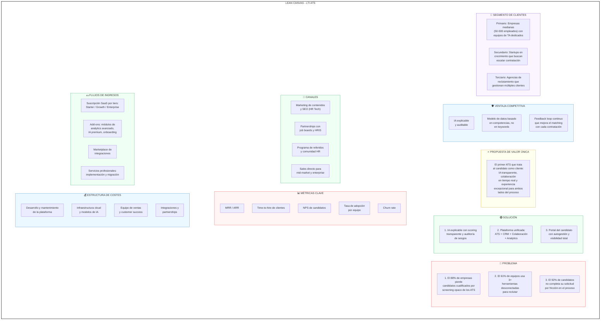
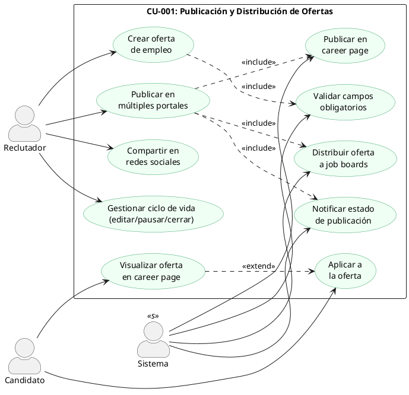
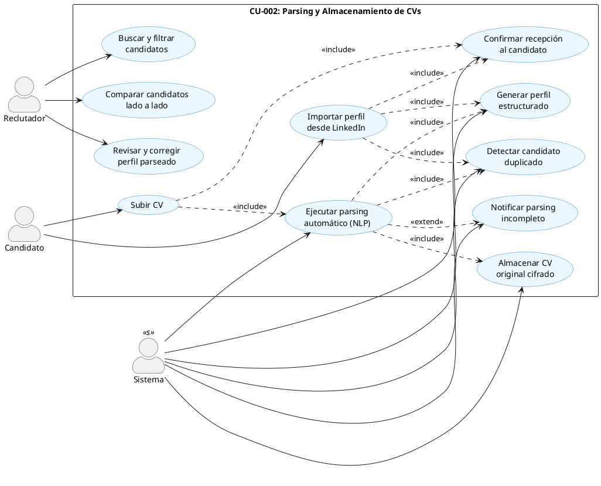
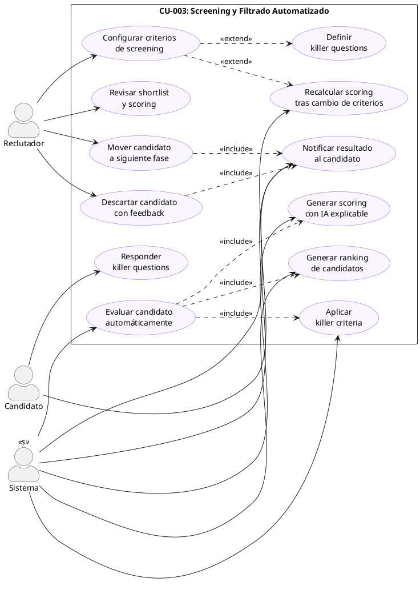

# LTI - Applicant Tracking System del Futuro

En la vista previa de este archivo en GitHub, los diagramas **Mermaid** se muestran automáticamente. Los bloques **PlantUML** y el modelo **Structurizr DSL** (sección 7) no se renderizan de forma nativa; puedes copiarlos a herramientas externas (por ejemplo el [servidor en línea de PlantUML](https://www.plantuml.com/plantuml/uml/) o [Structurizr](https://structurizr.com/)) para visualizarlos.

## 1. Introducción

### 1.1 Descripción del Producto

LTI (Leading Talent Intelligence) es un sistema de seguimiento de candidatos (ATS) de nueva generación diseñado para transformar la forma en que las empresas atraen, evalúan y contratan talento. A diferencia de los ATS tradicionales que funcionan como simples bases de datos de currículums, LTI actúa como un **ecosistema inteligente de adquisición de talento** que conecta a empresas, reclutadores y candidatos en un flujo de trabajo colaborativo, transparente y potenciado por inteligencia artificial.

### 1.2 Valor Añadido

LTI se diferencia del mercado actual por tres pilares fundamentales:

1. **IA Explicable y Auditable**: Mientras que el 79% de las organizaciones ya han integrado IA en sus procesos de contratación, la mayoría opera como una "caja negra". LTI ofrece scoring de candidatos con razonamiento transparente, auditoría de sesgos integrada y recomendaciones que el reclutador puede entender y justificar.

2. **Colaboración en Tiempo Real**: Los equipos de contratación (reclutadores, hiring managers, entrevistadores) trabajan en un espacio compartido con visibilidad total del pipeline, eliminando la fragmentación que sufren el 61% de los equipos que usan tres o más herramientas desconectadas.

3. **Experiencia del Candidato como Ciudadano de Primera Clase**: El candidato deja de ser un registro pasivo. LTI ofrece un portal donde el candidato ve su estado en tiempo real, programa entrevistas, recibe feedback estructurado y gestiona su perfil de competencias — reduciendo el abandono que afecta al 92% de las solicitudes no completadas.

### 1.3 Ventajas Competitivas

| Ventaja | LTI | ATS Tradicionales |
|---|---|---|
| Automatización con IA explicable | Scoring con justificación visible | Filtrado opaco por keywords |
| Evaluación basada en competencias | Skills-based matching | Filtrado por títulos y credenciales |
| Portal del candidato interactivo | Autogestión y transparencia total | Emails automáticos sin visibilidad |
| Arquitectura API-first | Integraciones nativas + marketplace | Integraciones limitadas o costosas |
| Onboarding integrado | Transición fluida candidato → empleado | Requiere herramienta separada |
| Analytics predictivos | Forecasting de hiring + detección de cuellos de botella | Reportes básicos retroactivos |

---

## 2. Investigación y Análisis de Mercado

### 2.1 Funcionalidades Básicas de un Sistema ATS

A continuación se listan las funcionalidades core de un ATS, ordenadas de mayor a menor prioridad según su impacto en el proceso de contratación:

1. **Publicación y Distribución de Ofertas de Empleo**
   Creación de ofertas y publicación simultánea en múltiples portales de empleo (LinkedIn, Indeed, Glassdoor, etc.), página de carreras propia y redes sociales. Es la puerta de entrada de todo el funnel de reclutamiento.

2. **Parsing y Almacenamiento de CVs**
   Extracción automática de datos de currículums (NLP) para estructurar perfiles de candidatos en la base de datos. Permite búsqueda, filtrado y comparación rápida sin lectura manual.

3. **Screening y Filtrado Automatizado de Candidatos**
   Evaluación automática de candidatos contra requisitos del puesto mediante criterios predefinidos, palabras clave, killer questions y, en sistemas modernos, scoring con IA. Reduce drásticamente el tiempo de criba.

4. **Gestión del Pipeline / Flujo de Contratación**
   Visualización tipo Kanban del proceso con etapas configurables (aplicado → cribado → entrevista → oferta → contratado). Permite mover candidatos entre fases con drag & drop y mantener el estado actualizado.

5. **Programación y Gestión de Entrevistas**
   Coordinación de agendas entre candidatos, reclutadores y hiring managers. Integración con calendarios (Google Calendar, Outlook) y envío automático de invitaciones y recordatorios.

6. **Comunicación Automatizada con Candidatos**
   Plantillas de email/SMS para cada etapa del proceso: confirmación de recepción, invitaciones a entrevista, actualizaciones de estado, rechazos y ofertas. Mantiene al candidato informado y mejora la experiencia.

7. **Colaboración y Evaluación en Equipo**
   Scorecards de entrevista, notas compartidas, valoraciones y comentarios entre miembros del equipo de contratación. Facilita decisiones consensuadas y reduce el sesgo individual.

8. **Portal de Carreras Personalizable (Career Site)**
   Página de empleo con marca de la empresa, integrada en su web, que actúa como escaparate del employer branding y punto de entrada orgánico de candidatos.

9. **Reporting y Analytics**
   Métricas clave: time-to-hire, cost-per-hire, source effectiveness, tasa de conversión por etapa, métricas DEI. Dashboards para toma de decisiones basada en datos.

10. **Gestión de Ofertas y Onboarding**
    Generación de cartas de oferta, gestión de negociaciones salariales, firma electrónica y transición al proceso de onboarding (documentación, formación inicial, integración con HRIS).

11. **CRM de Talento (Candidate Relationship Management)**
    Nurturing de candidatos pasivos, campañas de engagement, talent pools segmentados. Permite mantener relaciones a largo plazo con talento que no encaja en el momento pero puede ser valioso en el futuro.

12. **Cumplimiento Normativo y Seguridad**
    Gestión de consentimientos GDPR/LOPD, cumplimiento EEOC, audit trails, control de acceso basado en roles, cifrado de datos y políticas de retención.

13. **Integraciones con Ecosistema HR Tech**
    Conectores con HRIS, payroll, herramientas de background check, plataformas de video-entrevista, assessment tools, Slack, Teams, y otros sistemas del stack tecnológico de RRHH.

### 2.2 Beneficios del Sistema ATS

#### Para la Empresa / Reclutadores

- **Reducción del time-to-hire**: Los pipelines automatizados eliminan cuellos de botella entre etapas, reduciendo el tiempo medio de contratación entre un 30-50%.
- **Reducción de costes**: La automatización puede reducir el coste por contratación hasta un 40%, y un employer branding fuerte combinado con un buen ATS puede reducir costes de reclutamiento hasta un 50%.
- **Mejora de la calidad de contratación**: El screening basado en competencias y datos, junto con entrevistas estructuradas con scorecards, produce contrataciones más consistentes y reduce la rotación.
- **Cumplimiento normativo garantizado**: Procesos documentados y auditables que aseguran el cumplimiento de GDPR, EEOC y normativas locales.
- **Visibilidad y control**: Dashboards en tiempo real que permiten identificar cuellos de botella, medir la efectividad de fuentes y tomar decisiones estratégicas.
- **Escalabilidad**: Un proceso estandarizado que funciona igual con 5 vacantes que con 500, sin perder consistencia ni calidad.
- **Colaboración eficiente**: Los equipos dejan de depender de emails, hojas de cálculo y herramientas dispersas, trabajando todos en una única fuente de verdad.

#### Para el Candidato

- **Transparencia**: Visibilidad sobre el estado de su candidatura en todo momento, eliminando la incertidumbre que caracteriza los procesos tradicionales.
- **Experiencia fluida**: Procesos de aplicación mobile-first, sencillos y rápidos que reducen la fricción y el abandono.
- **Comunicación oportuna**: Actualizaciones automáticas en cada cambio de estado, feedback estructurado y tiempos de respuesta predecibles.
- **Autogestión**: Capacidad de programar entrevistas, actualizar su perfil y gestionar documentación desde un portal propio.
- **Evaluación justa**: Procesos estandarizados que aseguran que cada candidato es evaluado con los mismos criterios, reduciendo sesgos.

### 2.3 Customer Journey del Cliente de un ATS

El viaje del cliente (empresa) que adopta un sistema ATS sigue estas fases:

**Fase 1: Identificación de la Necesidad**
El equipo de RRHH o el hiring manager detecta que el proceso de contratación es ineficiente: se pierden candidatos, no hay visibilidad del pipeline, las hojas de cálculo no escalan, o la experiencia del candidato es deficiente. Comienza la búsqueda de soluciones.

**Fase 2: Evaluación y Selección del ATS**
Se investigan opciones, se solicitan demos, se comparan funcionalidades, precios e integraciones. Se valora la facilidad de implementación, el soporte y la escalabilidad. Se prueba el software (trial de 14 días típico) y se toma la decisión.

**Fase 3: Implementación y Configuración**
Se configura el ATS: estructura organizativa, flujos de trabajo por tipo de puesto, plantillas de comunicación, integraciones con el stack existente (HRIS, calendarios, job boards), roles y permisos, y migración de datos históricos.

**Fase 4: Publicación de Vacantes**
El hiring manager abre una requisición. Se define el perfil del puesto, requisitos, competencias y scorecard de evaluación. La oferta se publica en la career page y se distribuye automáticamente a job boards.

**Fase 5: Recepción y Screening de Candidaturas**
Los candidatos aplican. El ATS parsea los CVs, puntúa automáticamente a los candidatos y presenta un ranking. El reclutador revisa el shortlist, descarta candidatos no aptos y mueve a los seleccionados a la siguiente fase.

**Fase 6: Entrevistas y Evaluación**
Se programan entrevistas (coordinación automática de agendas). Cada entrevistador completa su scorecard. El equipo revisa feedback agregado y decide quién avanza. Se pueden incluir pruebas técnicas, assessments o video-entrevistas.

**Fase 7: Decisión y Oferta**
Se selecciona al candidato final. Se genera la oferta desde el ATS, se negocia si es necesario y se envía la carta de oferta con firma electrónica. Se notifica cortésmente a los candidatos no seleccionados.

**Fase 8: Onboarding**
El candidato aceptado transiciona a empleado. Se inicia el flujo de onboarding: documentación, accesos, formación, presentación al equipo. El ATS transfiere datos al HRIS.

**Fase 9: Análisis y Optimización Continua**
El equipo de TA revisa métricas: time-to-hire, coste por contratación, efectividad de fuentes, tasa de aceptación de ofertas, calidad de contratación a 90 días. Se ajustan los flujos y criterios para mejorar resultados.

### 2.4 Customer Journey del Candidato

En LTI, el candidato es un cliente. Su experiencia determina la reputación de la empresa empleadora y la calidad del talento que se consigue atraer. Este es su viaje:

**Fase 1: Descubrimiento**
El candidato descubre la oportunidad a través de un portal de empleo (LinkedIn, Indeed, InfoJobs), la career page de la empresa, una recomendación de un conocido, o una campaña de sourcing activo del reclutador. La primera impresión del employer branding se forma aquí.

**Fase 2: Investigación y Evaluación**
Antes de aplicar, el candidato investiga la empresa: cultura, valores, opiniones en Glassdoor, redes sociales, y condiciones del puesto. Evalúa si la oportunidad encaja con sus expectativas profesionales y personales. En LTI, la career page ofrece contenido auténtico (testimonios de empleados, vídeos del equipo, datos de cultura) que facilita esta decisión.

**Fase 3: Aplicación**
El candidato envía su candidatura. Este es el punto de mayor abandono: si el formulario es largo, poco intuitivo o no es mobile-friendly, el candidato lo abandona. LTI ofrece aplicación en menos de 3 clics, importación directa desde LinkedIn, y la posibilidad de adjuntar un perfil de competencias en lugar de un CV tradicional.

**Fase 4: Confirmación y Espera**
El candidato recibe confirmación inmediata de que su solicitud ha sido recibida, junto con una estimación del timeline del proceso y acceso a su portal personal. En los ATS tradicionales, este es un "agujero negro" donde el candidato no sabe si alguien ha visto su CV. En LTI, el portal muestra el estado en tiempo real.

**Fase 5: Screening y Feedback Temprano**
El candidato es evaluado por el sistema y/o el reclutador. Si no encaja, recibe una notificación de descarte con feedback constructivo (no un email genérico). Si avanza, recibe información sobre los próximos pasos y qué esperar. El candidato puede ver en su portal que ha pasado a la fase de entrevistas.

**Fase 6: Entrevistas**
El candidato programa sus entrevistas desde el portal, eligiendo entre los slots disponibles sin intercambio de emails. Recibe recordatorios, información sobre quién le entrevistará y consejos de preparación. Tras cada entrevista, el candidato puede ver que el proceso avanza (sin revelar evaluaciones internas).

**Fase 7: Pruebas y Assessments (si aplica)**
En algunos procesos, el candidato completa pruebas técnicas, assessments de personalidad o ejercicios prácticos. LTI integra estas herramientas directamente en el portal, evitando que el candidato tenga que navegar a plataformas externas desconectadas.

**Fase 8: Decisión Final**
El candidato recibe la decisión. Si es seleccionado, recibe la oferta formal directamente en el portal con todos los detalles (salario, beneficios, fecha de incorporación) y puede aceptarla y firmarla digitalmente. Si no es seleccionado, recibe una comunicación personalizada con feedback accionable y la opción de unirse al talent pool para futuras oportunidades.

**Fase 9: Onboarding (si acepta la oferta)**
El candidato transiciona a empleado dentro del mismo ecosistema. Desde su portal accede a la documentación a firmar, el plan de onboarding, presentaciones del equipo y recursos de la empresa. La experiencia es continua, sin rupturas entre "candidato" y "nuevo empleado".

**Fase 10: Relación Continua (si no fue seleccionado)**
Los candidatos no seleccionados que dieron su consentimiento permanecen en el talent pool de LTI. Reciben notificaciones personalizadas cuando se abren posiciones que encajan con su perfil de competencias, manteniendo una relación a largo plazo con la empresa.

---

## 3. Lean Canvas



---

## 3.5 Requisitos No Funcionales

Los requisitos no funcionales del sistema LTI se consolidan a continuación. Algunos derivan de restricciones técnicas ya documentadas en los PRDs; otros se identifican como necesarios para completar la especificación.

### Rendimiento

| Operación | Objetivo | Origen |
|---|---|---|
| Búsqueda full-text de perfiles | < 1 segundo | PRD-002 restricciones técnicas |
| Carga de career page | < 2 segundos en conexiones estándar | PRD-001 restricciones técnicas |
| Parsing de CV (asíncrono) | Tiempo máximo razonable tras recepción | PRD-002 US-002.3 |
| Scoring de candidato (asíncrono) | Sin bloqueo de interfaz | PRD-003 restricciones técnicas |
| Publicación en canales (asíncrona) | Sin bloqueo de interfaz | PRD-001 restricciones técnicas |

### Disponibilidad

| Requisito | Objetivo | Estado |
|---|---|---|
| SLA del sistema | Por definir | **Punto abierto** |
| Ventanas de mantenimiento | Por definir | **Punto abierto** |

### Escalabilidad

| Requisito | Objetivo | Estado |
|---|---|---|
| Volumen de candidatos concurrentes | Por definir | **Punto abierto** |
| Ofertas activas simultáneas por empresa | Por definir (vinculado a PA-001.4) | **Punto abierto** |
| CVs procesados por hora | Por definir | **Punto abierto** |
| Usuarios concurrentes por tenant | Por definir | **Punto abierto** |

### Seguridad

| Requisito | Origen |
|---|---|
| CVs almacenados con cifrado at-rest | PRD-002, sección 2.1 punto 12 |
| Cumplimiento GDPR/LOPD | PRD-002, sección 2.1 punto 12 |
| Gestión de consentimientos | Sección 2.1 punto 12 |
| Autenticación OAuth 2.0 / JWT | Sección 6.2 (API Gateway) |
| Control de acceso basado en roles (RBAC) | Sección 2.1 punto 12 (modelo pendiente de definición) |
| Audit trail completo (5W) | Modelo de datos AuditLog |
| Políticas de retención de datos | PRD-002 PA-002.5 |

### Resiliencia y Continuidad

| Requisito | Objetivo | Estado |
|---|---|---|
| Política de backups (frecuencia, tipo, retención) | Por definir | **Punto abierto** |
| RPO (Recovery Point Objective) | Por definir | **Punto abierto** |
| RTO (Recovery Time Objective) | Por definir | **Punto abierto** |
| Redundancia de BD principal | Por definir | **Punto abierto** |
| Redundancia de Object Storage (CVs) | Por definir | **Punto abierto** |
| Mecanismo de reconciliación BD ↔ Motor de búsqueda | Por definir | **Punto abierto** |

### Compatibilidad e Internacionalización

| Requisito | Objetivo | Estado |
|---|---|---|
| Navegadores soportados | Por definir | **Punto abierto** |
| Dispositivos móviles (responsive / PWA) | Mobile-first para Portal del Candidato | CJ candidato, PRD-002 |
| Accesibilidad (WCAG) | Por definir | **Punto abierto** |
| Idiomas del motor NLP | Español e inglés en lanzamiento | PRD-002 restricciones técnicas |
| Idiomas de la interfaz de usuario | Por definir | **Punto abierto** |

---

## 4. Casos de Uso Principales — PRDs

### 4.0 Alcance del MVP y Roadmap de Funcionalidades

Los PRDs desarrollados en esta sección (PRD-001, PRD-002 y PRD-003) corresponden al **MVP / v1** del sistema LTI. Cubren las tres funcionalidades de mayor impacto e interdependencia para un ATS funcional: publicación de ofertas, parsing de CVs y screening automatizado.

Las funcionalidades restantes de la sección 2.1 se planifican como roadmap post-MVP con la siguiente prioridad indicativa:

| Prioridad | ID | Funcionalidad | Dependencias MVP |
|---|---|---|---|
| P1 | F-004 | Gestión del Pipeline / Flujo de Contratación | PRD-001, PRD-003 |
| P1 | F-005 | Programación y Gestión de Entrevistas | PRD-003 (pipeline) |
| P1 | F-006 | Comunicación Automatizada con Candidatos | PRD-002, PRD-003 |
| P1 | F-007 | Colaboración y Evaluación en Equipo | PRD-003 (pipeline) |
| P2 | F-008 | Portal de Carreras Personalizable (Career Site) | PRD-001 |
| P2 | F-009 | Reporting y Analytics | PRD-001, PRD-002, PRD-003 |
| P2 | F-010 | Gestión de Ofertas y Onboarding | PRD-003 (pipeline) |
| P3 | F-011 | CRM de Talento (Candidate Relationship Management) | PRD-002 |
| P3 | F-012 | Cumplimiento Normativo y Seguridad (avanzado) | Todos |
| P3 | F-013 | Integraciones con Ecosistema HR Tech | Todos |

> **Nota**: La arquitectura (sección 6) y el modelo C4 (sección 7) se diseñan preparados para cubrir el roadmap completo, no solo el MVP. Los componentes correspondientes a funcionalidades post-MVP están identificados pero no tienen requisitos formalizados hasta que se desarrollen sus PRDs.

### 4.1 PRD-001: Publicación y Distribución de Ofertas de Empleo

#### Información General

| Campo | Detalle |
|---|---|
| **Título** | Publicación y Distribución de Ofertas de Empleo |
| **ID** | PRD-001 |
| **Prioridad** | P0 — Crítica |
| **Owner** | Product Manager |
| **Actores** | Reclutador, Candidato, Sistema |
| **Descripción** | Creación de ofertas y publicación simultánea en múltiples portales de empleo (LinkedIn, Indeed, Glassdoor, etc.), página de carreras propia y redes sociales. Es la puerta de entrada de todo el funnel de reclutamiento. |

#### Objetivos

- Permitir al reclutador crear ofertas de empleo de forma rápida y estructurada.
- Distribuir automáticamente la oferta a múltiples canales (job boards, career page, redes sociales) desde un único punto.
- Ofrecer al candidato un punto de entrada claro, accesible y alineado con el employer branding de la empresa.

#### User Stories

**US-001.1 — Creación de oferta de empleo**
*Como* reclutador, *quiero* crear una nueva oferta de empleo definiendo título, descripción, requisitos, competencias y ubicación, *para que* quede registrada en el sistema y lista para su publicación.

Criterios de Aceptación:
- El sistema presenta un formulario con campos obligatorios: título del puesto, departamento, ubicación, tipo de contrato, descripción del puesto, requisitos y competencias requeridas.
- El reclutador puede guardar la oferta como borrador sin publicarla.
- El sistema valida que todos los campos obligatorios estén completos antes de permitir la publicación.
- La oferta creada queda asociada a un pipeline de contratación con etapas configurables.

**US-001.2 — Publicación simultánea en múltiples portales**
*Como* reclutador, *quiero* seleccionar los portales de empleo donde publicar la oferta y publicar en todos simultáneamente, *para que* la oferta alcance la mayor audiencia posible sin esfuerzo manual repetitivo.

Criterios de Aceptación:
- El sistema muestra una lista de portales de empleo disponibles con los que está integrado.
- El reclutador puede seleccionar uno o varios portales de destino.
- Al confirmar, el sistema distribuye la oferta a todos los portales seleccionados de forma simultánea.
- El sistema confirma la publicación exitosa en cada portal o notifica errores individuales sin afectar al resto.
- Las ofertas publicadas son visibles en la career page de la empresa automáticamente.

**US-001.3 — Publicación en redes sociales**
*Como* reclutador, *quiero* compartir la oferta en redes sociales de la empresa, *para que* amplíe el alcance de la publicación a candidatos pasivos.

Criterios de Aceptación:
- El sistema permite compartir la oferta en redes sociales conectadas.
- Se genera un enlace público a la oferta en la career page para compartir manualmente en cualquier canal.

**US-001.4 — Visualización de la oferta por el candidato**
*Como* candidato, *quiero* ver las ofertas publicadas en la career page de la empresa o en portales de empleo con información clara y completa, *para que* pueda evaluar si la oportunidad encaja conmigo.

Criterios de Aceptación:
- La oferta se muestra con toda la información definida por el reclutador: título, descripción, requisitos, ubicación, tipo de contrato.
- La career page refleja el employer branding de la empresa (logo, colores, contenido de cultura).
- La oferta incluye un botón de aplicación visible y accesible.
- La visualización es responsive y funcional en dispositivos móviles.

**US-001.5 — Gestión del ciclo de vida de la oferta**
*Como* reclutador, *quiero* poder editar, pausar, reactivar o cerrar una oferta publicada, *para que* pueda gestionar el estado de las vacantes según las necesidades del proceso.

Criterios de Aceptación:
- El reclutador puede editar la oferta y los cambios se reflejan en todos los portales donde está publicada.
- El reclutador puede pausar una oferta, dejando de recibir candidaturas sin eliminarla.
- El reclutador puede cerrar una oferta, marcándola como cubierta o cancelada.
- El sistema registra el historial de cambios de estado de la oferta.

#### Edge Cases

- **Fallo de conexión con un portal externo**: Si un portal de empleo no responde durante la publicación, el sistema publica en el resto de portales correctamente y notifica al reclutador del fallo específico, ofreciendo reintentar la publicación en el portal fallido.
- **Oferta duplicada**: Si el reclutador intenta publicar una oferta con título y departamento idénticos a una oferta activa existente, el sistema muestra un aviso y pide confirmación antes de proceder.
- **Edición de oferta con candidaturas activas**: Si se editan los requisitos de una oferta que ya tiene candidaturas, el sistema advierte que las candidaturas existentes fueron evaluadas contra requisitos anteriores.

#### Restricciones Técnicas

- La integración con portales de empleo externos se realiza vía APIs de cada plataforma; la disponibilidad y formato dependen del proveedor externo.
- La career page debe cargarse en menos de 2 segundos en conexiones estándar.
- La publicación simultánea debe procesarse de forma asíncrona para no bloquear la interfaz del reclutador.
- Todas las ofertas deben almacenarse cumpliendo con las políticas de retención y GDPR/LOPD.

#### Puntos Abiertos

| ID | Punto Abierto | Responsable | Fecha Límite |
|---|---|---|---|
| PA-001.1 | Definir la lista final de portales de empleo que estarán disponibles en la integración de lanzamiento (v1). | Product Manager + Partnerships | Pendiente |
| PA-001.2 | Definir las redes sociales que se conectarán de forma nativa (vs. compartir por enlace). | Product Manager | Pendiente |
| PA-001.3 | Determinar si la career page se ofrece como subdominio gestionado por LTI o como widget embebible en la web del cliente. | Product Manager + Ingeniería | Pendiente |
| PA-001.4 | Definir los límites de ofertas activas simultáneas por plan de suscripción (Starter / Growth / Enterprise). | Product Manager + Negocio | Pendiente |
| PA-001.5 | Establecer el SLA de sincronización de cambios entre LTI y los portales externos tras una edición de oferta. | Ingeniería | Pendiente |
| PA-001.6 | Definir el diagrama de estados de la oferta con valores cerrados (borrador, publicada, pausada, cerrada_cubierta, cerrada_cancelada) y transiciones válidas entre ellos. Documentar que cada cambio de estado genera un registro en AuditLog para trazabilidad. | Product Manager + Ingeniería | Pendiente |

#### Diagrama UML de Caso de Uso



---

### 4.2 PRD-002: Parsing y Almacenamiento de CVs

#### Información General

| Campo | Detalle |
|---|---|
| **Título** | Parsing y Almacenamiento de CVs |
| **ID** | PRD-002 |
| **Prioridad** | P0 — Crítica |
| **Owner** | Product Manager |
| **Actores** | Reclutador, Candidato, Sistema |
| **Descripción** | Extracción automática de datos de currículums (NLP) para estructurar perfiles de candidatos en la base de datos. Permite búsqueda, filtrado y comparación rápida sin lectura manual. |

#### Objetivos

- Extraer automáticamente datos estructurados de los CVs recibidos mediante procesamiento de lenguaje natural (NLP).
- Crear perfiles de candidatos estructurados en la base de datos que permitan búsqueda, filtrado y comparación.
- Eliminar la necesidad de lectura manual de CVs para la fase inicial de organización de candidaturas.

#### User Stories

**US-002.1 — Envío de CV por el candidato**
*Como* candidato, *quiero* adjuntar mi CV al aplicar a una oferta, *para que* mis datos queden registrados en el proceso de selección.

Criterios de Aceptación:
- El candidato puede subir su CV en formatos PDF, DOC y DOCX.
- El candidato puede adjuntar un perfil de competencias en lugar de un CV tradicional.
- El sistema confirma la recepción exitosa del documento inmediatamente.
- El tamaño máximo de archivo aceptado es comunicado al candidato antes de la subida.

**US-002.2 — Importación de perfil desde LinkedIn**
*Como* candidato, *quiero* importar mi perfil directamente desde LinkedIn como alternativa a subir un CV, *para que* pueda aplicar de forma rápida sin necesidad de tener un CV preparado.

Criterios de Aceptación:
- El candidato puede conectar su cuenta de LinkedIn desde el flujo de aplicación.
- El sistema importa los datos del perfil de LinkedIn (experiencia, formación, competencias, contacto) y los estructura como un perfil de candidato.
- La importación sustituye la necesidad de subir un archivo CV.
- El sistema confirma la importación exitosa y muestra un resumen de los datos importados al candidato.

**US-002.3 — Parsing automático del CV**
*Como* sistema, *quiero* extraer automáticamente los datos del CV recibido mediante NLP (nombre, contacto, experiencia, formación, competencias, idiomas), *para que* se genere un perfil estructurado del candidato sin intervención manual.

Criterios de Aceptación:
- El sistema extrae como mínimo: nombre completo, email, teléfono, experiencia laboral (empresa, puesto, fechas), formación académica, competencias/habilidades e idiomas.
- Los datos extraídos se almacenan en campos estructurados en la base de datos.
- El parsing se ejecuta automáticamente tras la recepción del CV, sin acción del reclutador.
- El sistema genera el perfil estructurado en un tiempo máximo razonable tras la recepción.

**US-002.4 — Revisión y corrección del perfil parseado**
*Como* reclutador, *quiero* revisar el perfil estructurado generado por el parsing y corregir o completar datos si la extracción fue imprecisa, *para que* la información del candidato sea fiable para las fases posteriores.

Criterios de Aceptación:
- El reclutador puede visualizar el perfil estructurado junto al CV original para comparar.
- Todos los campos extraídos son editables por el reclutador.
- Los cambios manuales quedan registrados como correcciones sobre el parsing automático.
- El CV original permanece accesible y descargable en todo momento.

**US-002.5 — Búsqueda y filtrado de candidatos**
*Como* reclutador, *quiero* buscar y filtrar candidatos almacenados por competencias, experiencia, formación, ubicación u otros campos estructurados, *para que* pueda localizar perfiles relevantes rápidamente sin leer CVs manualmente.

Criterios de Aceptación:
- El sistema permite búsqueda por texto libre sobre los campos estructurados.
- El reclutador puede aplicar filtros combinados (por competencias, años de experiencia, formación, ubicación, idiomas).
- Los resultados se presentan en un listado ordenable y paginado.
- El reclutador puede acceder al perfil completo y al CV original desde los resultados de búsqueda.

**US-002.6 — Comparación de candidatos**
*Como* reclutador, *quiero* comparar los perfiles estructurados de varios candidatos lado a lado, *para que* pueda evaluar diferencias y similitudes de forma rápida y visual.

Criterios de Aceptación:
- El reclutador puede seleccionar dos o más candidatos de un listado para compararlos.
- La comparación muestra los campos estructurados clave en columnas paralelas.
- Las coincidencias y diferencias con los requisitos del puesto se destacan visualmente.

#### Edge Cases

- **CV en formato no soportado**: Si el candidato intenta subir un archivo en formato no soportado (por ejemplo, imagen JPG de un CV escaneado sin OCR), el sistema informa de los formatos aceptados y sugiere alternativas.
- **CV con datos incompletos o desestructurados**: Si el NLP no puede extraer campos mínimos (nombre, contacto), el sistema marca el perfil como "parsing incompleto" y notifica al reclutador para revisión manual.
- **CV en idioma no soportado**: Si el CV está en un idioma que el motor NLP no soporta, el sistema almacena el documento e informa que la extracción automática no está disponible para ese idioma.
- **Candidato duplicado**: Si el sistema detecta que un candidato con el mismo email ya existe en la base de datos, vincula la nueva candidatura al perfil existente en lugar de crear un duplicado, y notifica al reclutador.

#### Restricciones Técnicas

- El motor de NLP debe soportar como mínimo español e inglés en el lanzamiento.
- Los CVs originales deben almacenarse cifrados cumpliendo GDPR/LOPD.
- El parsing debe ejecutarse de forma asíncrona para no bloquear el flujo de aplicación del candidato.
- Los perfiles estructurados deben indexarse para búsqueda full-text con tiempos de respuesta inferiores a 1 segundo.
- El sistema debe gestionar políticas de retención de datos: los CVs de candidatos no contratados se eliminan tras el período definido por la empresa, salvo consentimiento explícito del candidato.

#### Puntos Abiertos

| ID | Punto Abierto | Responsable | Fecha Límite |
|---|---|---|---|
| PA-002.1 | Definir la lista completa de formatos de archivo soportados para la subida de CV (¿incluir RTF, ODT?). | Product Manager + Ingeniería | Pendiente |
| PA-002.2 | Determinar los idiomas soportados por el motor NLP más allá de español e inglés en el roadmap. | Ingeniería + IA | Pendiente |
| PA-002.3 | **⚠️ RIESGO ALTO**: Validar la viabilidad técnica y comercial de la integración con LinkedIn: nivel de acceso requerido (API básica vs. Partner Program vs. Apply with LinkedIn), proceso de aprobación, costes asociados y datos disponibles según el nivel de acceso. LinkedIn ha restringido progresivamente su API y el acceso a datos completos de perfil requiere aprobación específica del Partner Program. Definir un plan alternativo si la integración completa no es viable en el lanzamiento (por ejemplo, importación manual de PDF exportado desde LinkedIn). | Ingeniería + Partnerships + Legal | Pendiente |
| PA-002.4 | Establecer el criterio de detección de duplicados: ¿solo por email o también por combinación nombre + teléfono? | Product Manager | Pendiente |
| PA-002.5 | Definir los períodos de retención de CVs por defecto y las opciones configurables por empresa. | Legal + Product Manager | Pendiente |
| PA-002.6 | Determinar si se soportará OCR para CVs escaneados como imagen en la v1 o será funcionalidad futura. | Product Manager + Ingeniería | Pendiente |

#### Diagrama UML de Caso de Uso



---

### 4.3 PRD-003: Screening y Filtrado Automatizado de Candidatos

#### Información General

| Campo | Detalle |
|---|---|
| **Título** | Screening y Filtrado Automatizado de Candidatos |
| **ID** | PRD-003 |
| **Prioridad** | P0 — Crítica |
| **Owner** | Product Manager |
| **Actores** | Reclutador, Candidato, Sistema |
| **Descripción** | Evaluación automática de candidatos contra requisitos del puesto mediante criterios predefinidos, palabras clave, killer questions y, en sistemas modernos, scoring con IA. Reduce drásticamente el tiempo de criba. |

#### Objetivos

- Evaluar automáticamente a los candidatos contra los requisitos definidos del puesto.
- Generar un scoring/ranking de candidatos basado en criterios predefinidos, palabras clave y killer questions.
- Ofrecer scoring con IA explicable, donde el reclutador entiende por qué cada candidato recibió su puntuación.
- Reducir drásticamente el tiempo de criba sin sacrificar la calidad del filtrado.

#### User Stories

**US-003.1 — Configuración de criterios de screening**
*Como* reclutador, *quiero* definir los criterios de evaluación para una oferta (competencias requeridas, experiencia mínima, formación, palabras clave y killer questions), *para que* el sistema pueda evaluar automáticamente a los candidatos contra estos requisitos.

Criterios de Aceptación:
- El reclutador puede definir criterios obligatorios (killer criteria) que descalifican automáticamente si no se cumplen.
- El reclutador puede definir criterios deseables con pesos relativos para el scoring.
- El reclutador puede añadir killer questions que el candidato debe responder al aplicar.
- Los criterios se vinculan a la oferta de empleo correspondiente.
- El reclutador puede reutilizar plantillas de criterios de ofertas anteriores.

**US-003.2 — Respuesta a killer questions por el candidato**
*Como* candidato, *quiero* responder a las preguntas de filtrado (killer questions) durante mi aplicación, *para que* mi candidatura sea evaluada de forma completa.

Criterios de Aceptación:
- Las killer questions se presentan al candidato como parte del flujo de aplicación.
- Las preguntas soportan formatos de respuesta: sí/no, selección múltiple, numérica y texto libre.
- El candidato debe responder todas las preguntas obligatorias antes de enviar su candidatura.
- Las respuestas se almacenan vinculadas al perfil del candidato y a la oferta.

**US-003.3 — Evaluación automática y scoring**
*Como* sistema, *quiero* evaluar automáticamente a cada candidato contra los criterios definidos para la oferta y generar un scoring, *para que* los candidatos queden ordenados por nivel de adecuación al puesto.

Criterios de Aceptación:
- El sistema compara los datos del perfil estructurado del candidato (generado por el parsing) con los criterios definidos por el reclutador.
- Los candidatos que no cumplen killer criteria se marcan automáticamente como "no aptos".
- Los candidatos que superan los killer criteria reciben un scoring numérico basado en los criterios deseables y sus pesos.
- El scoring se calcula con IA explicable: cada puntuación incluye una justificación visible de los factores que contribuyen al resultado.
- El sistema genera un ranking ordenado de candidatos por scoring de mayor a menor.

**US-003.4 — Revisión del shortlist por el reclutador**
*Como* reclutador, *quiero* revisar el ranking de candidatos generado por el sistema, ver la justificación del scoring de cada uno y decidir quién avanza a la siguiente fase, *para que* pueda tomar decisiones informadas basándome en datos y no solo en intuición.

Criterios de Aceptación:
- El reclutador ve el listado de candidatos ordenados por scoring.
- Al hacer clic en un candidato, puede ver el desglose del scoring: qué criterios cumple, cuáles no, y la justificación de la IA.
- El reclutador puede mover candidatos a la siguiente fase del pipeline o descartarlos.
- El reclutador puede sobrescribir la decisión del sistema (aprobar un candidato con scoring bajo o descartar uno con scoring alto), registrando el motivo.
- Al descartar un candidato, el sistema envía notificación con feedback constructivo (no un email genérico).

**US-003.5 — Notificación de resultado al candidato**
*Como* candidato, *quiero* recibir notificación sobre el resultado de mi screening (si avanzo o no) con feedback constructivo, *para que* sepa el estado de mi candidatura y pueda mejorar en futuras aplicaciones.

Criterios de Aceptación:
- El candidato recibe notificación cuando pasa a la siguiente fase, con información sobre los próximos pasos.
- El candidato recibe notificación si es descartado, con feedback constructivo sobre los motivos.
- Las notificaciones se envían automáticamente al cambiar el estado del candidato en el pipeline.
- El candidato puede ver el estado actualizado en su portal personal en tiempo real.

#### Edge Cases

- **Todos los candidatos descartados por killer criteria**: Si todos los candidatos de una oferta son descartados automáticamente, el sistema notifica al reclutador y sugiere revisar si los criterios son demasiado restrictivos.
- **Empate en scoring**: Si varios candidatos obtienen el mismo scoring, el sistema los presenta al mismo nivel en el ranking sin crear un orden arbitrario, permitiendo al reclutador decidir.
- **Candidato con perfil incompleto (parsing parcial)**: Si el perfil del candidato tiene campos sin datos (por parsing incompleto), el scoring se calcula con los datos disponibles y se indica que la evaluación es parcial, sugiriendo revisión manual.
- **Reclutador sobrescribe todas las decisiones del sistema**: Si el reclutador descarta candidatos con scoring alto de forma recurrente, el sistema registra el patrón para análisis de optimización de criterios (sin bloquear al reclutador).
- **Cambio de criterios con candidatos ya evaluados**: Si el reclutador modifica los criterios de screening de una oferta que ya tiene candidatos evaluados, el sistema ofrece recalcular el scoring de todos los candidatos con los nuevos criterios.

#### Restricciones Técnicas

- El scoring con IA debe ser explicable: cada factor de la puntuación debe tener una justificación textual auditable.
- La auditoría de sesgos debe ejecutarse sobre el modelo de scoring para verificar que no discrimina por género, edad, origen u otros factores protegidos.
- El recálculo de scoring para una oferta con gran volumen de candidatos debe ejecutarse de forma asíncrona sin bloquear la interfaz.
- Las killer questions y sus respuestas deben almacenarse cumpliendo GDPR/LOPD.
- El sistema debe registrar un audit trail de todas las decisiones automatizadas y manuales sobre candidatos para cumplimiento normativo.

#### Puntos Abiertos

| ID | Punto Abierto | Responsable | Fecha Límite |
|---|---|---|---|
| PA-003.1 | Definir el algoritmo/modelo de IA que se utilizará para el scoring y el nivel de explicabilidad requerido. | Ingeniería + IA | Pendiente |
| PA-003.2 | Determinar los formatos de respuesta soportados en killer questions (¿incluir vídeo-respuesta, adjuntos?). | Product Manager | Pendiente |
| PA-003.3 | Establecer el framework de auditoría de sesgos: frecuencia, métricas, umbrales de alerta y proceso de remediación. | Legal + IA + Product Manager | Pendiente |
| PA-003.4 | Definir el modelo de feedback constructivo al candidato descartado: (1) nivel de detalle — genérico por categoría de descarte, basado en competencias sin scoring numérico, o personalizado con justificación de la IA; (2) mecanismo de generación — automático por IA, manual por reclutador, o híbrido con borrador IA + aprobación del reclutador; (3) revisión legal sobre implicaciones de compartir motivos de descarte según jurisdicción aplicable. | Product Manager + UX + Legal | Pendiente |
| PA-003.5 | Determinar si el recálculo masivo de scoring tras cambio de criterios es automático o requiere confirmación del reclutador. | Product Manager + Ingeniería | Pendiente |
| PA-003.6 | Definir los límites de killer questions por oferta y si el candidato puede ver su propio scoring parcial. | Product Manager + UX | Pendiente |

#### Diagrama UML de Caso de Uso



---

## 5. Modelado de Datos

### 5.1 Descripción del Modelo

El modelo de datos de LTI se ha diseñado a partir de las entidades, atributos y relaciones identificadas en la documentación de las fases anteriores: funcionalidades core (sección 2.1), customer journeys (secciones 2.3 y 2.4), y los PRDs de los tres casos de uso principales (sección 4). El modelo refleja los tres flujos fundamentales del sistema:

1. **Flujo de publicación**: Empresa → Reclutador → Oferta → Publicación en Canales (job boards y redes sociales unificados).
2. **Flujo de candidatura**: Candidato → CV/LinkedIn → Perfil Estructurado (parsing NLP) → Candidatura vinculada a Oferta.
3. **Flujo de screening**: Criterios + Killer Questions → Evaluación automática → Scoring con IA explicable (con trazabilidad del modelo LLM) → Decisiones con auditoría completa.

### 5.2 Diagrama Entidad-Relación

```mermaid
erDiagram
    %% ============================================
    %% ENTIDADES ORGANIZATIVAS
    %% ============================================

    Empresa {
        uuid id PK
        string nombre
        string dominio_web
        string logo_url
        string sector
        text descripcion_cultura
        string plan_suscripcion
        datetime fecha_alta
        boolean activa
    }

    Usuario {
        uuid id PK
        uuid empresa_id FK
        string nombre
        string apellidos
        string email
        string rol
        datetime fecha_alta
        boolean activo
    }

    %% ============================================
    %% ENTIDADES DE OFERTA Y PUBLICACION
    %% ============================================

    OfertaEmpleo {
        uuid id PK
        uuid empresa_id FK
        uuid usuario_id FK
        string titulo
        string departamento
        string ubicacion
        string tipo_contrato
        text descripcion
        text requisitos
        string estado
        datetime fecha_creacion
        datetime fecha_publicacion
        datetime fecha_cierre
    }

    EtapaPipeline {
        uuid id PK
        uuid oferta_id FK
        string nombre
        int orden
        boolean es_etapa_final
    }

    CanalPublicacion {
        uuid id PK
        string nombre
        string tipo
        string api_url
        boolean activo
    }

    Publicacion {
        uuid id PK
        uuid oferta_id FK
        uuid canal_id FK
        string estado
        datetime fecha_publicacion
        datetime fecha_actualizacion
        string url_externa
    }

    %% ============================================
    %% ENTIDADES DE CANDIDATO Y PERFIL
    %% ============================================

    Candidato {
        uuid id PK
        string nombre
        string apellidos
        string email "UNIQUE por tenant"
        string telefono
        string ubicacion
        string linkedin_url
        boolean consentimiento_gdpr
        boolean en_talent_pool
        datetime fecha_ingreso_talent_pool
        datetime fecha_registro
        datetime fecha_ultimo_acceso
    }

    CV {
        uuid id PK
        uuid candidato_id FK
        string nombre_archivo
        string formato
        string url_almacenamiento_cifrado
        int tamano_bytes
        string idioma_detectado
        string estado_parsing
        datetime fecha_subida
        datetime fecha_expiracion_retencion
    }

    PerfilEstructurado {
        uuid id PK
        uuid candidato_id FK
        int version
        string estado_parsing
        json idiomas
        json formacion_academica
        datetime fecha_creacion
        datetime fecha_ultima_edicion
        string editado_por
    }

    OrigenPerfil {
        uuid id PK
        uuid perfil_id FK
        uuid cv_id FK "nullable"
        string tipo_origen "cv_parsing | linkedin_import | edicion_manual"
        json campos_actualizados
        datetime fecha
    }

    HistorialPerfil {
        uuid id PK
        uuid perfil_id FK
        int version
        json snapshot_datos
        datetime fecha_snapshot
        string motivo
    }

    ExperienciaLaboral {
        uuid id PK
        uuid perfil_id FK
        string empresa
        string puesto
        date fecha_inicio
        date fecha_fin
        text descripcion
    }

    Competencia {
        uuid id PK
        string nombre
        string categoria
    }

    %% ============================================
    %% ENTIDADES DE CANDIDATURA Y PIPELINE
    %% ============================================

    Candidatura {
        uuid id PK
        uuid candidato_id FK
        uuid oferta_id FK
        uuid etapa_actual_id FK
        string estado "activa | descartada | retirada | oferta_enviada | oferta_aceptada | oferta_rechazada | contratado"
        decimal scoring
        string justificacion_scoring
        boolean evaluacion_parcial
        datetime fecha_aplicacion
        datetime fecha_ultima_actualizacion
    }

    %% ============================================
    %% ENTIDADES DE COLABORACION Y ENTREVISTAS
    %% ============================================

    Entrevista {
        uuid id PK
        uuid candidatura_id FK
        uuid entrevistador_id FK
        datetime fecha_hora
        int duracion_minutos
        string tipo "presencial | video | telefonica"
        string estado "programada | completada | cancelada"
        string enlace_videoconferencia
    }

    Scorecard {
        uuid id PK
        uuid entrevista_id FK
        uuid evaluador_id FK
        decimal puntuacion_global
        string recomendacion "contratar | no_contratar | indeciso"
        datetime fecha_evaluacion
    }

    CriterioScorecard {
        uuid id PK
        uuid scorecard_id FK
        string criterio
        decimal puntuacion
        text comentario
    }

    Nota {
        uuid id PK
        uuid candidatura_id FK
        uuid autor_id FK
        text contenido
        string visible_para "equipo_completo | hiring_managers | privada"
        datetime fecha_creacion
    }

    %% ============================================
    %% ENTIDADES DE SCREENING
    %% ============================================

    CriterioScreening {
        uuid id PK
        uuid oferta_id FK
        string nombre
        string tipo
        decimal peso
        boolean es_killer_criteria
        text descripcion
    }

    KillerQuestion {
        uuid id PK
        uuid oferta_id FK
        text pregunta
        string formato_respuesta
        boolean obligatoria
        int orden
    }

    RespuestaKillerQuestion {
        uuid id PK
        uuid killer_question_id FK
        uuid candidatura_id FK
        text respuesta
        datetime fecha_respuesta
    }

    ScoringDetalle {
        uuid id PK
        uuid candidatura_id FK
        uuid criterio_id FK
        decimal puntuacion
        text justificacion_ia
        boolean criterio_cumplido
        string modelo_llm
        string version_modelo_llm
        datetime fecha_calculo
    }

    %% ============================================
    %% ENTIDADES TRANSVERSALES
    %% ============================================

    PlantillaNotificacion {
        uuid id PK
        uuid empresa_id FK
        uuid etapa_origen_id FK "nullable"
        uuid etapa_destino_id FK "nullable"
        string evento_trigger "cambio_etapa | descarte | oferta | aplicacion_recibida"
        string canal "email | sms | push"
        string asunto_template
        text contenido_template
        string idioma
        boolean activa
    }

    Notificacion {
        uuid id PK
        uuid candidato_id FK
        uuid candidatura_id FK
        uuid plantilla_id FK "nullable"
        string tipo
        string canal
        string asunto
        text contenido
        string estado
        datetime fecha_envio
    }

    AuditLog {
        uuid id PK
        uuid actor_id FK
        string actor_tipo
        string accion
        string entidad
        uuid entidad_id
        json datos_antes
        json datos_despues
        string motivo
        string ip_origen
        string user_agent
        datetime fecha
    }

    %% ============================================
    %% RELACIONES
    %% ============================================

    Empresa ||--o{ Usuario : "emplea"
    Empresa ||--o{ OfertaEmpleo : "publica"
    Empresa ||--o{ PlantillaNotificacion : "configura"

    Usuario ||--o{ OfertaEmpleo : "gestiona"

    OfertaEmpleo ||--o{ EtapaPipeline : "define etapas"
    OfertaEmpleo ||--o{ Publicacion : "se distribuye en"
    OfertaEmpleo ||--o{ Candidatura : "recibe"
    OfertaEmpleo ||--o{ CriterioScreening : "tiene criterios"
    OfertaEmpleo ||--o{ KillerQuestion : "incluye preguntas"

    CanalPublicacion ||--o{ Publicacion : "aloja"

    Candidato ||--o{ CV : "sube"
    Candidato ||--|| PerfilEstructurado : "tiene perfil"
    Candidato ||--o{ Candidatura : "aplica"
    Candidato ||--o{ Notificacion : "recibe"

    CV ||--o{ OrigenPerfil : "genera origen"

    PerfilEstructurado ||--o{ ExperienciaLaboral : "contiene"
    PerfilEstructurado }o--o{ Competencia : "posee"
    PerfilEstructurado ||--o{ OrigenPerfil : "tiene origenes"
    PerfilEstructurado ||--o{ HistorialPerfil : "tiene historial"

    Candidatura ||--|| EtapaPipeline : "se encuentra en"
    Candidatura ||--o{ RespuestaKillerQuestion : "responde"
    Candidatura ||--o{ ScoringDetalle : "tiene desglose"
    Candidatura ||--o{ Notificacion : "genera"
    Candidatura ||--o{ Entrevista : "tiene entrevistas"
    Candidatura ||--o{ Nota : "tiene notas"

    Entrevista ||--o| Scorecard : "genera evaluacion"
    Entrevista }o--|| Usuario : "asignada a entrevistador"

    Scorecard ||--o{ CriterioScorecard : "detalla criterios"
    Scorecard }o--|| Usuario : "completada por evaluador"

    Nota }o--|| Usuario : "escrita por"

    KillerQuestion ||--o{ RespuestaKillerQuestion : "recibe respuestas"

    CriterioScreening ||--o{ ScoringDetalle : "evalua mediante"

    PlantillaNotificacion ||--o{ Notificacion : "genera"
    PlantillaNotificacion }o--o| EtapaPipeline : "vinculada a etapa origen"
    PlantillaNotificacion }o--o| EtapaPipeline : "vinculada a etapa destino"
```



### 5.3 Notas sobre el Modelo

**Decisiones de diseño derivadas de la documentación:**

- **Usuario generaliza Reclutador**: La entidad `Reclutador` se ha sustituido por `Usuario` con campo `rol` que admite valores como `reclutador`, `hiring_manager`, `entrevistador`, `admin`, `viewer`. Esto cubre todos los actores del equipo de contratación descritos en la sección 1.2 y la funcionalidad 7 (sección 2.1). La definición formal de permisos por rol (modelo RBAC) queda como punto abierto (ver sección de Puntos Abiertos Globales).
- **Candidato ↔ PerfilEstructurado**: Relación 1:1 con modelo acumulativo versionado. Un candidato tiene un único perfil estructurado que se enriquece con cada CV o importación de LinkedIn (US-002.1, US-002.2). El campo `version` registra el número de actualización. El perfil acumula datos con merge aditivo: los nuevos datos complementan los existentes, y los conflictos se resuelven priorizando el dato más reciente.
- **OrigenPerfil como tabla de trazabilidad**: Sustituye al anterior campo `cv_id` en `PerfilEstructurado`. Cada actualización del perfil (ya sea por parsing de CV, importación de LinkedIn o edición manual) genera un registro en `OrigenPerfil` que traza qué fuente aportó qué campos (`campos_actualizados` en JSON). Esto permite auditar exactamente de dónde proviene cada dato del perfil acumulativo.
- **HistorialPerfil para snapshots**: Antes de cada actualización del perfil, se almacena un snapshot completo del estado anterior en `HistorialPerfil`. El reclutador puede consultar versiones anteriores del perfil para comparar evolución.
- **Candidatura como entidad pivote**: Vincula Candidato con Oferta y contiene el scoring agregado y la referencia a la etapa actual. Es la entidad central del flujo de screening (PRD-003). El campo `etapa_actual_id` representa la posición en el pipeline configurable (flujo de trabajo), mientras que `estado` representa el estado administrativo con valores cerrados: `activa`, `descartada`, `retirada`, `oferta_enviada`, `oferta_aceptada`, `oferta_rechazada`, `contratado`. Ambos conceptos son ortogonales — un candidato puede ser descartado en cualquier etapa del pipeline.
- **Entrevista, Scorecard, CriterioScorecard y Nota**: Nuevas entidades que soportan la colaboración y evaluación en equipo (sección 1.2, funcionalidad 7 de sección 2.1). La `Entrevista` se vincula a `Candidatura` y a un `Usuario` entrevistador. La `Scorecard` permite registrar la evaluación de cada entrevistador con detalle por criterio. La `Nota` permite notas compartidas con control de visibilidad (equipo completo, solo hiring managers, o privada).
- **PlantillaNotificacion**: Nueva entidad que soporta las plantillas de comunicación descritas en la sección 2.1 punto 6 y el customer journey empresa fase 3. Permite configurar plantillas por evento (cambio de etapa, descarte, oferta) y canal (email, SMS, push) con variables sustituibles. Cada `Notificacion` generada referencia opcionalmente la plantilla desde la que se generó (`plantilla_id`), manteniendo el texto renderizado en `contenido` para auditoría.
- **Candidato con campos de Talent Pool**: Los campos `en_talent_pool` y `fecha_ingreso_talent_pool` cubren la fase 10 del customer journey del candidato (sección 2.4) de forma mínima. Las entidades completas de CRM de Talento (segmentación, campañas) se desarrollarán con el PRD correspondiente en el roadmap post-MVP.
- **Unicidad de email en Candidato**: El campo `email` tiene restricción de unicidad a nivel de tenant (empresa), lo que constituye el mecanismo básico de detección de candidatos duplicados referenciado en el edge case de PRD-002.
- **ScoringDetalle con trazabilidad LLM**: Implementa la IA explicable documentada en la sección 1.2 y US-003.3. Además de la puntuación y justificación por criterio, registra qué modelo LLM (`modelo_llm`, `version_modelo_llm`) y cuándo (`fecha_calculo`) se realizó la evaluación. Esto permite auditar y comparar resultados entre versiones del modelo, y es esencial para el framework de auditoría de sesgos (PA-003.3).
- **Competencia como entidad independiente**: Tabla normalizada con relación many-to-many con PerfilEstructurado, alineada con el enfoque de evaluación basada en competencias (skills-based matching) descrito en la sección 1.3.

**Cambios respecto a la versión anterior y justificación:**

- **Usuario reemplaza a Reclutador**: La entidad `Reclutador` se generaliza a `Usuario` para soportar múltiples roles del equipo de contratación (reclutador, hiring manager, entrevistador). Se elimina el campo `permisos` (string) pendiente de definición del modelo RBAC completo.
- **AuditLog reemplaza a AuditTrail**: La nueva entidad responde a las 5W (quién, qué, cuándo, dónde, cómo): `actor_id` + `actor_tipo` (quién — soporta tanto usuarios como acciones del sistema), `accion` + `entidad` + `entidad_id` (qué), `fecha` (cuándo), `ip_origen` + `user_agent` (dónde), `datos_antes` + `datos_despues` en JSON (cómo). Registra modificaciones y consultas sobre cualquier entidad del modelo, no solo sobre candidaturas. Se elimina la relación directa con Candidatura para que AuditLog sea una entidad transversal independiente que audita todo el sistema.
- **CanalPublicacion unifica portales y redes sociales**: Renombrado de `PortalEmpleo` a `CanalPublicacion` con campo `tipo` que admite valores como "job_board" o "red_social". Esto cubre tanto US-001.2 (portales) como US-001.3 (redes sociales) con una única entidad y tabla `Publicacion`, evitando duplicar infraestructura cuando se resuelvan los puntos abiertos PA-001.1 y PA-001.2.
- **Idiomas y formación como campos JSON en PerfilEstructurado**: Las entidades `IdiomaCandidato` y `FormacionAcademica` se simplifican a campos JSON dentro de `PerfilEstructurado`. Los tres PRDs no definen filtrado ni scoring explícito por estos campos — el parsing los extrae (US-002.3) pero el screening (PRD-003) opera sobre competencias, experiencia, palabras clave y killer questions. Cuando el roadmap incorpore screening por idioma o formación, se normalizarán a tablas propias.
- **OrigenPerfil reemplaza cv_id en PerfilEstructurado**: El campo `cv_id` (FK) se elimina de `PerfilEstructurado` porque asumía una relación 1:1 entre CV y perfil, incompatible con el modelo acumulativo. La nueva tabla `OrigenPerfil` traza cada fuente de actualización del perfil con detalle de campos modificados.
- **Nuevas entidades de colaboración**: Se añaden `Entrevista`, `Scorecard`, `CriterioScorecard` y `Nota` para dar soporte al modelo de datos de las funcionalidades de colaboración y evaluación en equipo, alineando el modelo con los componentes definidos en la arquitectura (sección 6) y el modelo C4 (sección 7).
- **PlantillaNotificacion como nueva entidad**: Se añade para cubrir el gap entre las plantillas de comunicación descritas en múltiples secciones del documento y su ausencia en el modelo de datos anterior.

---

## 6. Diseño de Arquitectura a Alto Nivel

### 6.1 Visión General

La arquitectura de LTI se diseña como un sistema **cloud-native, orientado a eventos y con API-first** como principio rector. Las decisiones arquitectónicas se derivan directamente de los requisitos documentados en las fases anteriores:

| Requisito del Documento | Driver Arquitectónico | Decisión |
|---|---|---|
| Arquitectura API-first (sección 1.3) | Todas las capacidades del sistema deben ser consumibles vía API | API Gateway como punto de entrada único con REST/WebSocket |
| Multitenancy SaaS con 3 tiers (Lean Canvas) | Aislamiento de datos por empresa, configuración por plan | Tenant isolation a nivel de base de datos con Row-Level Security |
| Parsing asíncrono sin bloquear al candidato (PRD-002) | Procesamiento pesado desacoplado del request-response | Cola de mensajes para trabajos de parsing NLP |
| Publicación simultánea asíncrona (PRD-001) | Distribución a múltiples canales sin bloqueo | Cola de mensajes para distribución a canales externos |
| Recálculo de scoring asíncrono (PRD-003) | Scoring masivo sin bloquear la interfaz | Cola de mensajes para evaluación con LLM |
| Búsqueda full-text < 1 segundo (PRD-002) | Indexación y búsqueda de alto rendimiento sobre perfiles | Motor de búsqueda dedicado separado de la BD principal |
| Career page < 2 segundos (PRD-001) | Contenido estático servido con baja latencia | CDN para assets estáticos y career pages |
| Colaboración en tiempo real (sección 1.2) | Actualizaciones instantáneas entre miembros del equipo | WebSockets para eventos en tiempo real |
| Portal del candidato con estado en tiempo real (sección 1.2, CJ candidato) | El candidato ve cambios de estado al instante | WebSockets para notificaciones push al portal |
| CVs cifrados y GDPR/LOPD (PRD-002, sección 2.1) | Almacenamiento seguro con cifrado y políticas de retención | Object Storage cifrado + servicio de gestión de consentimientos |
| Scoring con IA explicable y trazabilidad LLM (PRD-003, modelo de datos) | Llamadas a modelos LLM con auditoría de versión | Servicio de IA dedicado que abstrae el proveedor LLM |
| Notificaciones multicanal automáticas (sección 2.1, PRD-003) | Envío de emails y SMS en cada cambio de estado | Servicio de notificaciones con plantillas y colas |
| Integraciones con job boards, LinkedIn, HRIS, calendarios (sección 2.1) | Conectores heterogéneos con APIs externas | Capa de integraciones con adaptadores por proveedor |
| Auditoría completa 5W (modelo de datos AuditLog) | Registro de toda acción sobre cualquier entidad | Middleware de auditoría transversal que intercepta operaciones |

### 6.2 Decisiones de Arquitectura (ADRs resumidos)

**ADR-001: Arquitectura basada en servicios (no microservicios puros)**
El sistema se organiza en servicios de dominio bien delimitados, pero desplegados como un conjunto cohesivo, no como microservicios independientes desde el día 1. LTI es una startup (Lean Canvas) que necesita velocidad de iteración. Los servicios comparten base de datos con esquemas separados por dominio, y se comunican vía eventos internos. Cuando el volumen lo justifique, los servicios con más carga (IA/Scoring, Parsing) pueden extraerse a despliegues independientes.

**ADR-002: Cola de mensajes como columna vertebral asíncrona**
Tres de los tres PRDs requieren procesamiento asíncrono: publicación en canales (PRD-001), parsing NLP (PRD-002) y scoring con LLM (PRD-003). En lugar de implementar asincronía ad-hoc, se adopta una cola de mensajes central como patrón uniforme. Cada trabajo se encola, se procesa por workers especializados y el resultado se notifica vía eventos.

**ADR-003: Servicio de IA como abstracción del proveedor LLM**
El modelo de datos registra `modelo_llm` y `version_modelo_llm` en ScoringDetalle (fase 3). Esto implica que el sistema debe soportar cambios de proveedor/modelo sin afectar al resto de la aplicación. Se crea un servicio dedicado que encapsula las llamadas a LLMs, gestiona prompts, parsea respuestas y registra la trazabilidad. Si mañana se cambia de proveedor, solo se modifica este servicio.

**ADR-004: Motor de búsqueda dedicado para perfiles**
La restricción de PRD-002 exige búsqueda full-text con respuesta inferior a 1 segundo. La base de datos relacional principal no garantiza este rendimiento para búsquedas complejas sobre campos de texto libre de perfiles estructurados. Se añade un motor de búsqueda que indexa perfiles y se sincroniza desde la BD principal vía eventos.

**ADR-005: WebSockets para tiempo real**
La colaboración en tiempo real (sección 1.2) y el portal del candidato con estado en tiempo real (customer journey del candidato, fases 4-6) requieren que los cambios se propaguen instantáneamente a los clientes conectados. Se implementa una capa de WebSockets que emite eventos cuando cambia el estado de una candidatura, se completa un scoring o se publica una oferta.

**ADR-006: CDN para career pages y assets**
La restricción de carga en menos de 2 segundos para la career page (PRD-001) y la naturaleza estática/semi-estática de este contenido (logo, descripción de cultura, ofertas activas) justifica servir estas páginas desde una CDN con invalidación por eventos cuando cambia el contenido.

### 6.3 Diagrama de Arquitectura

```mermaid
graph TB
    subgraph Clients["🖥️ CLIENTES"]
        direction LR
        WebApp["🌐 App Web<br/><i>Reclutador</i>"]
        CandidatePortal["👤 Portal Candidato<br/><i>Mobile-first</i>"]
        CareerSite["🏢 Career Page<br/><i>Employer Branding</i>"]
        ExternalAPI["🔌 API Externa<br/><i>Integraciones 3rd party</i>"]
    end

    subgraph Gateway["🚪 API GATEWAY"]
        direction LR
        REST["REST API"]
        WS["WebSocket<br/>Server"]
        Auth["Autenticación<br/>& Autorización"]
    end

    subgraph Core["⚙️ SERVICIOS DE DOMINIO"]
        direction TB

        subgraph Recruitment["Gestión de Reclutamiento"]
            OfferService["📋 Servicio de<br/>Ofertas"]
            PipelineService["📊 Servicio de<br/>Pipeline"]
            CandidateService["👥 Servicio de<br/>Candidatos"]
        end

        subgraph Intelligence["Motor de Inteligencia"]
            ParsingService["🔍 Servicio de<br/>Parsing NLP"]
            ScoringService["🧠 Servicio de<br/>Scoring IA"]
            LLMGateway["🤖 Gateway LLM<br/><i>Abstracción de proveedor</i>"]
        end

        subgraph Communication["Comunicación"]
            NotificationService["📨 Servicio de<br/>Notificaciones"]
            RealTimeService["⚡ Servicio de<br/>Tiempo Real"]
        end
    end

    subgraph Async["📬 CAPA ASÍNCRONA"]
        MessageQueue["Cola de Mensajes"]
        ParsingWorker["Worker<br/>Parsing"]
        ScoringWorker["Worker<br/>Scoring"]
        PublishWorker["Worker<br/>Publicación"]
        NotifWorker["Worker<br/>Notificaciones"]
    end

    subgraph Data["💾 CAPA DE DATOS"]
        direction LR
        MainDB[("🐘 Base de Datos<br/>Principal<br/><i>Relacional + RLS</i>")]
        SearchEngine[("🔎 Motor de<br/>Búsqueda<br/><i>Full-text indexing</i>")]
        FileStorage[("📁 Object Storage<br/><i>CVs cifrados</i>")]
        Cache[("⚡ Caché<br/><i>Sesiones + consultas</i>")]
    end

    subgraph Integrations["🔗 INTEGRACIONES EXTERNAS"]
        direction LR
        JobBoards["Job Boards<br/><i>LinkedIn, Indeed...</i>"]
        SocialMedia["Redes Sociales"]
        CalendarAPI["Calendarios<br/><i>Google, Outlook</i>"]
        HRIS["HRIS / Payroll"]
        LLMProviders["Proveedores LLM<br/><i>OpenAI, Anthropic...</i>"]
    end

    subgraph Cross["🛡️ SERVICIOS TRANSVERSALES"]
        direction LR
        AuditService["📝 Auditoría<br/><i>5W logging</i>"]
        CDN["🌍 CDN<br/><i>Career pages + assets</i>"]
        GDPR["🔒 GDPR &<br/>Compliance"]
    end

    %% --- Conexiones de clientes al gateway ---
    WebApp --> REST
    WebApp --> WS
    CandidatePortal --> REST
    CandidatePortal --> WS
    CareerSite --> CDN
    ExternalAPI --> REST

    %% --- Gateway a servicios ---
    REST --> Auth
    WS --> Auth
    Auth --> Core

    %% --- Servicios core a capa asíncrona ---
    OfferService --> MessageQueue
    CandidateService --> MessageQueue
    ScoringService --> MessageQueue

    %% --- Workers ---
    MessageQueue --> ParsingWorker
    MessageQueue --> ScoringWorker
    MessageQueue --> PublishWorker
    MessageQueue --> NotifWorker

    %% --- Workers a servicios/datos ---
    ParsingWorker --> LLMGateway
    ScoringWorker --> LLMGateway
    PublishWorker --> Integrations
    NotifWorker --> NotificationService

    %% --- Servicio IA a proveedores ---
    LLMGateway --> LLMProviders

    %% --- Servicios a datos ---
    Core --> MainDB
    Core --> Cache
    CandidateService --> FileStorage
    ParsingService --> SearchEngine
    MainDB --> SearchEngine

    %% --- Integraciones ---
    OfferService --> JobBoards
    OfferService --> SocialMedia
    PipelineService --> CalendarAPI
    CandidateService --> HRIS

    %% --- Tiempo real ---
    RealTimeService --> WS

    %% --- Transversales ---
    Core --> AuditService
    AuditService --> MainDB
    Core --> GDPR

    %% --- Estilos ---
    classDef client fill:#E8F4FD,stroke:#2196F3,stroke-width:2px,color:#1565C0
    classDef gateway fill:#FFF3E0,stroke:#FF9800,stroke-width:2px,color:#E65100
    classDef service fill:#E8F5E9,stroke:#4CAF50,stroke-width:2px,color:#2E7D32
    classDef intelligence fill:#F3E5F5,stroke:#9C27B0,stroke-width:2px,color:#6A1B9A
    classDef async fill:#FFF8E1,stroke:#FFC107,stroke-width:2px,color:#F57F17
    classDef data fill:#ECEFF1,stroke:#607D8B,stroke-width:2px,color:#37474F
    classDef integration fill:#FCE4EC,stroke:#E91E63,stroke-width:2px,color:#880E4F
    classDef cross fill:#EFEBE9,stroke:#795548,stroke-width:2px,color:#4E342E

    class WebApp,CandidatePortal,CareerSite,ExternalAPI client
    class REST,WS,Auth gateway
    class OfferService,PipelineService,CandidateService,NotificationService,RealTimeService service
    class ParsingService,ScoringService,LLMGateway intelligence
    class MessageQueue,ParsingWorker,ScoringWorker,PublishWorker,NotifWorker async
    class MainDB,SearchEngine,FileStorage,Cache data
    class JobBoards,SocialMedia,CalendarAPI,HRIS,LLMProviders integration
    class AuditService,CDN,GDPR cross
```



### 6.4 Descripción de Componentes

**Capa de Clientes**
Cuatro puntos de entrada diferenciados, derivados de los dos customer journeys (secciones 2.3 y 2.4): la App Web para el reclutador con pipeline Kanban y dashboards; el Portal del Candidato mobile-first para autogestión (customer journey candidato fases 3-9); la Career Page servida desde CDN para employer branding (funcionalidad 8); y la API Externa para integraciones de terceros (arquitectura API-first, sección 1.3).

**API Gateway**
Punto de entrada unificado que gestiona autenticación (OAuth 2.0 / JWT), autorización basada en roles (sección 2.1, punto 12), rate limiting por plan de suscripción (PA-001.4), y enrutamiento a servicios. Expone tanto REST para operaciones CRUD como WebSockets para tiempo real (sección 1.2).

**Servicios de Dominio — Gestión de Reclutamiento**
Tres servicios que modelan el core del negocio alineados con los PRDs: el Servicio de Ofertas gestiona el ciclo de vida de la oferta (US-001.1 a US-001.5) y encola la distribución a canales; el Servicio de Pipeline gestiona etapas, movimiento de candidatos y scorecards (funcionalidad 4); el Servicio de Candidatos gestiona perfiles, CVs, candidaturas y la detección de duplicados (PRD-002).

**Servicios de Dominio — Motor de Inteligencia**
El Servicio de Parsing NLP recibe CVs desde la cola, extrae datos estructurados y actualiza el perfil (US-002.3). El Servicio de Scoring IA evalúa candidatos contra criterios y genera justificaciones explicables (US-003.3). Ambos delegan en el Gateway LLM, que abstrae al proveedor (ADR-003) y registra `modelo_llm` y `version_modelo_llm` en cada llamada para la trazabilidad definida en el modelo de datos.

**Capa Asíncrona**
Cola de mensajes central (ADR-002) con cuatro tipos de workers especializados: Parsing (procesa CVs), Scoring (evalúa candidatos con LLM), Publicación (distribuye ofertas a canales externos) y Notificaciones (envía emails/SMS). Cada worker es idempotente y reintentable, cubriendo los edge cases de fallos de conexión (PRD-001) y procesamiento parcial (PRD-002, PRD-003).

**Capa de Datos**
Cuatro almacenes especializados: la Base de Datos Principal relacional con Row-Level Security para multitenancy (ADR-001); el Motor de Búsqueda que indexa perfiles para búsqueda full-text sub-segundo (ADR-004); Object Storage con cifrado at-rest para CVs (GDPR, PRD-002); y Caché para sesiones, consultas frecuentes y reducción de latencia.

**Integraciones Externas**
Adaptadores específicos para cada tipo de integración: job boards y redes sociales (unificados bajo CanalPublicacion del modelo de datos), calendarios para programación de entrevistas (funcionalidad 5), HRIS para transferencia en onboarding (funcionalidad 10), y proveedores LLM accedidos exclusivamente a través del Gateway LLM.

**Servicios Transversales**
El Servicio de Auditoría implementa el AuditLog del modelo de datos con las 5W, interceptando operaciones como middleware. El CDN sirve career pages y assets estáticos (ADR-006). El módulo de GDPR & Compliance gestiona consentimientos, políticas de retención y el derecho al olvido (sección 2.1, punto 12).

---

## 7. Modelo C4 — Capa de Clientes

### 7.1 Contexto del Modelo

El modelo C4 se aplica sobre la **Capa de Clientes** definida en la arquitectura (sección 6.3). Esta capa comprende los cuatro puntos de entrada al sistema LTI: la App Web del Reclutador, el Portal del Candidato, la Career Page y la API Externa. El modelo se desarrolla en los cuatro niveles del estándar C4 (Context, Container, Component, Code), utilizando el formato Structurizr DSL.

Las decisiones de descomposición se basan exclusivamente en:
- Los PRDs (sección 4): user stories que definen qué hace cada interfaz.
- Los customer journeys (secciones 2.3 y 2.4): interacciones paso a paso de cada actor.
- Las restricciones técnicas: mobile-first, < 2s career page, tiempo real vía WebSockets.
- La arquitectura de alto nivel (sección 6): conexiones con API Gateway, CDN y servicios backend.

### 7.2 Structurizr DSL

```dsl
workspace "LTI ATS - Capa de Clientes" "Modelo C4 completo de la Capa de Clientes del sistema LTI ATS" {

    !identifiers hierarchical

    model {

        # =============================================
        # NIVEL 1 — CONTEXT: Personas y Sistemas
        # =============================================

        reclutador = person "Reclutador" {
            description "Profesional de RRHH o Talent Acquisition que gestiona ofertas, evalúa candidatos y toma decisiones de contratación."
            tags "Usuario Interno"
        }

        candidato = person "Candidato" {
            description "Persona que busca empleo, aplica a ofertas, programa entrevistas y gestiona su candidatura desde el portal."
            tags "Usuario Externo"
        }

        visitante = person "Visitante" {
            description "Persona que navega la career page de una empresa para explorar oportunidades antes de decidir si aplica."
            tags "Usuario Externo"
        }

        sistemaExterno = person "Sistema Externo" {
            description "Aplicación de terceros (HRIS, herramienta interna, integración custom) que consume la API de LTI."
            tags "Sistema Externo"
        }

        # --- Sistema LTI ---
        lti = softwareSystem "LTI ATS" {
            description "Applicant Tracking System de nueva generación con IA explicable, colaboración en tiempo real y experiencia del candidato como ciudadano de primera clase."
            tags "Sistema Principal"

            # =============================================
            # NIVEL 2 — CONTAINERS: Aplicaciones cliente
            # =============================================

            webApp = container "App Web Reclutador" {
                description "Aplicación web SPA para reclutadores: gestión de ofertas, pipeline Kanban, screening con IA, colaboración en equipo y analytics."
                technology "React SPA"
                tags "Frontend" "Web App"

                # =============================================
                # NIVEL 3 — COMPONENTS: App Web Reclutador
                # =============================================

                # Derivado de PRD-001: US-001.1 a US-001.5
                offerManagement = component "Módulo de Gestión de Ofertas" {
                    description "Creación, edición, publicación, pausa y cierre de ofertas de empleo. Incluye formulario con validación de campos obligatorios, selección de canales de publicación y gestión del ciclo de vida."
                    technology "React Components + Forms"
                    tags "Componente UI"
                }

                # Derivado de funcionalidad 4 (sección 2.1) y CJ empresa fase 5-6
                pipelineBoard = component "Pipeline Kanban" {
                    description "Visualización tipo Kanban del flujo de contratación con etapas configurables. Permite drag & drop de candidatos entre fases y muestra estado actualizado en tiempo real."
                    technology "React DnD + WebSocket Client"
                    tags "Componente UI"
                }

                # Derivado de PRD-002: US-002.4, US-002.5, US-002.6
                candidateExplorer = component "Explorador de Candidatos" {
                    description "Búsqueda full-text y filtrado por competencias, experiencia, formación, ubicación e idiomas. Incluye comparación lado a lado de perfiles estructurados."
                    technology "React Components + Search Client"
                    tags "Componente UI"
                }

                # Derivado de PRD-003: US-003.1, US-003.4
                screeningDashboard = component "Dashboard de Screening" {
                    description "Configuración de criterios de evaluación (killer criteria, criterios deseables con pesos, killer questions). Visualización del ranking con desglose del scoring y justificación de la IA por candidato."
                    technology "React Components + Data Viz"
                    tags "Componente UI"
                }

                # Derivado de PRD-002: US-002.4 y funcionalidad 7 (sección 2.1)
                candidateProfile = component "Visor de Perfil de Candidato" {
                    description "Vista detallada del perfil estructurado junto al CV original. Permite revisión y corrección de datos parseados, notas compartidas y scorecards de entrevista."
                    technology "React Components + PDF Viewer"
                    tags "Componente UI"
                }

                # Derivado de funcionalidad 9 (sección 2.1) y CJ empresa fase 9
                analyticsModule = component "Módulo de Analytics" {
                    description "Dashboards con métricas clave: time-to-hire, cost-per-hire, source effectiveness, tasa de conversión por etapa y métricas DEI. Forecasting de hiring y detección de cuellos de botella."
                    technology "React + Recharts"
                    tags "Componente UI"
                }

                # Derivado de sección 1.2 y funcionalidad 7 (sección 2.1)
                collaborationHub = component "Hub de Colaboración" {
                    description "Espacio compartido para el equipo de contratación: notas, comentarios, valoraciones, scorecards y menciones. Actualizaciones en tiempo real vía WebSocket."
                    technology "React Components + WebSocket Client"
                    tags "Componente UI"
                }

                # Derivado de funcionalidad 6 (sección 2.1) y PRD-001
                notificationCenter = component "Centro de Notificaciones" {
                    description "Panel de notificaciones del reclutador: alertas de nuevas candidaturas, parsing completado, scoring listo, fallos de publicación y recordatorios de entrevista."
                    technology "React Components + WebSocket Client"
                    tags "Componente UI"
                }

                # Componente transversal de comunicación
                apiClient = component "API Client" {
                    description "Capa de abstracción para comunicación con el backend: llamadas REST al API Gateway, conexión WebSocket para eventos en tiempo real y gestión de autenticación JWT."
                    technology "Axios + WebSocket Client + JWT Handler"
                    tags "Componente Infraestructura"
                }
            }

            candidatePortal = container "Portal del Candidato" {
                description "Aplicación web mobile-first para candidatos: aplicación a ofertas, subida de CV, importación LinkedIn, seguimiento de estado, programación de entrevistas y firma de ofertas."
                technology "React SPA (Mobile-first PWA)"
                tags "Frontend" "Portal"

                # =============================================
                # NIVEL 3 — COMPONENTS: Portal del Candidato
                # =============================================

                # Derivado de PRD-002: US-002.1, US-002.2 y CJ candidato fase 3
                applicationModule = component "Módulo de Aplicación" {
                    description "Flujo de aplicación en menos de 3 clics: subida de CV (PDF/DOC/DOCX), importación desde LinkedIn, adjuntar perfil de competencias y respuesta a killer questions. Mobile-first y responsive."
                    technology "React Components + File Upload + OAuth LinkedIn"
                    tags "Componente UI"

                    # =============================================
                    # NIVEL 4 — CODE: Módulo de Aplicación
                    # =============================================

                    # Derivado de US-002.1
                    cvUploader = component "CV Uploader" {
                        description "Widget de subida de archivos con validación de formato (PDF/DOC/DOCX), límite de tamaño, barra de progreso y confirmación de recepción. Soporta drag & drop y selección de archivo."
                        technology "React Dropzone + Validation"
                        tags "Code Level"
                    }

                    # Derivado de US-002.2
                    linkedInImporter = component "LinkedIn Importer" {
                        description "Componente OAuth que conecta con LinkedIn, importa datos del perfil (experiencia, formación, competencias, contacto), muestra resumen de datos importados y confirma la importación."
                        technology "OAuth 2.0 Client + LinkedIn API"
                        tags "Code Level"
                    }

                    # Derivado de PRD-003: US-003.2
                    killerQuestionsForm = component "Killer Questions Form" {
                        description "Formulario dinámico que renderiza killer questions según la oferta. Soporta formatos sí/no, selección múltiple, numérico y texto libre. Valida respuestas obligatorias antes del envío."
                        technology "React Hook Form + Dynamic Renderer"
                        tags "Code Level"
                    }

                    # Derivado de CJ candidato fase 3
                    applicationOrchestrator = component "Application Orchestrator" {
                        description "Controlador del flujo de aplicación: orquesta los pasos (seleccionar método de entrada → subir CV o importar LinkedIn → responder killer questions → confirmar envío) en menos de 3 clics."
                        technology "React State Machine"
                        tags "Code Level"
                    }
                }

                # Derivado de CJ candidato fases 4-5-8 y sección 1.2
                statusTracker = component "Tracker de Estado" {
                    description "Panel en tiempo real que muestra el estado de cada candidatura del candidato: etapa actual en el pipeline, próximos pasos esperados y timeline estimado. Se actualiza vía WebSocket."
                    technology "React Components + WebSocket Client"
                    tags "Componente UI"
                }

                # Derivado de CJ candidato fase 6
                interviewScheduler = component "Programador de Entrevistas" {
                    description "Interfaz de self-service para que el candidato elija slots de entrevista disponibles, vea información sobre entrevistadores y reciba recordatorios y consejos de preparación."
                    technology "React Calendar + REST Client"
                    tags "Componente UI"
                }

                # Derivado de CJ candidato fase 8 y funcionalidad 10 (sección 2.1)
                offerManager = component "Gestor de Ofertas Recibidas" {
                    description "Visualización de la oferta formal (salario, beneficios, fecha de incorporación), aceptación/rechazo y firma digital integrada."
                    technology "React Components + E-Signature Client"
                    tags "Componente UI"
                }

                # Derivado de CJ candidato fases 5 y 8
                feedbackViewer = component "Visor de Feedback" {
                    description "Sección donde el candidato recibe feedback constructivo tras descarte, información sobre próximos pasos al avanzar, y la opción de unirse al talent pool."
                    technology "React Components"
                    tags "Componente UI"
                }

                # Derivado de CJ candidato fase 9
                onboardingHub = component "Hub de Onboarding" {
                    description "Espacio post-aceptación para el nuevo empleado: documentación a firmar, plan de onboarding, presentaciones del equipo y recursos de la empresa. Transición continua sin ruptura."
                    technology "React Components + Document Viewer"
                    tags "Componente UI"
                }

                # Componente transversal
                portalApiClient = component "API Client (Portal)" {
                    description "Capa de comunicación del portal: REST para operaciones, WebSocket para estado en tiempo real, gestión de sesión del candidato y manejo de tokens."
                    technology "Axios + WebSocket Client + Session Handler"
                    tags "Componente Infraestructura"
                }
            }

            careerSite = container "Career Page" {
                description "Página de empleo pública con employer branding personalizable, listado de ofertas activas y punto de entrada orgánico para candidatos. Servida desde CDN con carga < 2 segundos."
                technology "SSG (Static Site Generation) + CDN"
                tags "Frontend" "Web Publica"

                # =============================================
                # NIVEL 3 — COMPONENTS: Career Page
                # =============================================

                # Derivado de funcionalidad 8 (sección 2.1) y CJ candidato fase 1-2
                brandingSection = component "Sección de Employer Branding" {
                    description "Contenido de cultura de la empresa: logo, colores corporativos, descripción de cultura, testimonios de empleados, vídeos del equipo y datos de cultura. Personalizable por empresa."
                    technology "HTML/CSS + CMS Templates"
                    tags "Componente UI"
                }

                # Derivado de PRD-001: US-001.4 y CJ candidato fase 1
                jobListing = component "Listado de Ofertas" {
                    description "Catálogo de ofertas activas con filtros por ubicación, departamento y tipo de contrato. Cada oferta muestra título, descripción, requisitos y botón de aplicación."
                    technology "SSG Components + Search/Filter"
                    tags "Componente UI"
                }

                # Derivado de PRD-001: US-001.4 y US-001.2
                jobDetail = component "Detalle de Oferta" {
                    description "Página individual de cada oferta con información completa (título, descripción, requisitos, ubicación, tipo de contrato) y CTA de aplicación que redirige al Portal del Candidato."
                    technology "SSG Components"
                    tags "Componente UI"
                }

                # Derivado de CJ candidato fase 3
                applicationCTA = component "Call-to-Action de Aplicación" {
                    description "Botón visible y accesible en cada oferta que inicia el flujo de aplicación. Redirige al Portal del Candidato con la oferta preseleccionada. Responsive y funcional en móvil."
                    technology "HTML/JS + Deep Link"
                    tags "Componente UI"
                }

                # Componente de generación estática
                siteGenerator = component "Generador Estático" {
                    description "Proceso que genera la career page estática a partir de datos de la empresa y ofertas activas. Se re-genera vía evento cuando cambia contenido de empresa u ofertas (invalidación CDN)."
                    technology "SSG Build Pipeline + CDN Invalidation"
                    tags "Componente Infraestructura"
                }
            }

            externalApi = container "API Externa" {
                description "Interfaz REST pública y documentada para integraciones de terceros: HRIS, herramientas internas, automatizaciones y desarrolladores que extienden LTI."
                technology "REST API (OpenAPI 3.0)"
                tags "API"

                # =============================================
                # NIVEL 3 — COMPONENTS: API Externa
                # =============================================

                # Derivado de sección 1.3 (API-first) y funcionalidad 13 (sección 2.1)
                restEndpoints = component "REST Endpoints" {
                    description "Endpoints RESTful documentados con OpenAPI 3.0 para operaciones CRUD sobre ofertas, candidatos, candidaturas, pipeline y scoring. Versionados y con paginación."
                    technology "OpenAPI 3.0 + JSON"
                    tags "Componente API"
                }

                # Derivado de funcionalidad 13 y CJ empresa fase 3
                webhooks = component "Sistema de Webhooks" {
                    description "Mecanismo de notificación push para eventos del sistema: nueva candidatura, cambio de etapa, scoring completado, oferta aceptada. Configurable por empresa con retry automático."
                    technology "HTTP Callbacks + Retry Queue"
                    tags "Componente API"
                }

                # Derivado de sección 2.1 punto 12 y modelo de datos AuditLog
                authModule = component "Módulo de Autenticación API" {
                    description "Gestión de API keys por empresa, OAuth 2.0 para integraciones, rate limiting por plan de suscripción y logging de accesos en el AuditLog."
                    technology "OAuth 2.0 + API Key Management"
                    tags "Componente Infraestructura"
                }

                # Derivado de funcionalidad 13 (sección 2.1)
                apiDocumentation = component "Documentación Interactiva" {
                    description "Portal de documentación generado automáticamente desde la especificación OpenAPI. Incluye sandbox para pruebas, ejemplos de código y guías de integración."
                    technology "Swagger UI / Redoc"
                    tags "Componente API"
                }
            }

            # --- Contenedores Backend (referencia para relaciones) ---
            apiGateway = container "API Gateway" {
                description "Punto de entrada unificado: autenticación, autorización, rate limiting y enrutamiento a servicios backend."
                technology "API Gateway + Auth"
                tags "Backend"
            }

            cdn = container "CDN" {
                description "Red de distribución de contenido para career pages y assets estáticos."
                technology "CDN"
                tags "Infraestructura"
            }

            websocketServer = container "WebSocket Server" {
                description "Servidor de eventos en tiempo real para colaboración y estado de candidaturas."
                technology "WebSocket Server"
                tags "Backend"
            }
        }

        # --- Sistemas externos (referencia) ---
        linkedin = softwareSystem "LinkedIn" {
            description "Plataforma profesional para importación de perfiles y publicación de ofertas."
            tags "Sistema Externo"
        }

        hris = softwareSystem "HRIS / Payroll" {
            description "Sistemas de gestión de recursos humanos y nómina del cliente."
            tags "Sistema Externo"
        }

        jobBoards = softwareSystem "Job Boards" {
            description "Portales de empleo externos donde se publican las ofertas."
            tags "Sistema Externo"
        }

        # =============================================
        # RELACIONES — NIVEL 1 (Context)
        # =============================================

        reclutador -> lti "Gestiona ofertas, evalúa candidatos, colabora con el equipo" "HTTPS"
        candidato -> lti "Aplica a ofertas, programa entrevistas, consulta estado" "HTTPS"
        visitante -> lti "Navega career pages y explora oportunidades" "HTTPS"
        sistemaExterno -> lti "Consume API REST para integración" "HTTPS/REST"
        lti -> linkedin "Importa perfiles y publica ofertas" "OAuth 2.0 / API"
        lti -> jobBoards "Distribuye ofertas a portales" "REST API"
        lti -> hris "Transfiere datos de onboarding" "REST API"

        # =============================================
        # RELACIONES — NIVEL 2 (Container)
        # =============================================

        reclutador -> lti.webApp "Usa" "Browser HTTPS"
        candidato -> lti.candidatePortal "Usa" "Browser/Móvil HTTPS"
        visitante -> lti.careerSite "Navega" "Browser HTTPS"
        sistemaExterno -> lti.externalApi "Consume" "HTTPS/REST"

        lti.webApp -> lti.apiGateway "Llama a" "REST/JSON"
        lti.webApp -> lti.websocketServer "Se suscribe a eventos" "WSS"
        lti.candidatePortal -> lti.apiGateway "Llama a" "REST/JSON"
        lti.candidatePortal -> lti.websocketServer "Recibe estado en tiempo real" "WSS"
        lti.careerSite -> lti.cdn "Servida desde" "HTTPS"
        lti.externalApi -> lti.apiGateway "Enruta a" "REST/JSON"

        lti.candidatePortal -> linkedin "Importa perfil vía OAuth" "OAuth 2.0"

        # =============================================
        # RELACIONES — NIVEL 3 (Component)
        # =============================================

        # --- App Web Reclutador ---
        lti.webApp.offerManagement -> lti.webApp.apiClient "Usa" ""
        lti.webApp.pipelineBoard -> lti.webApp.apiClient "Usa" ""
        lti.webApp.candidateExplorer -> lti.webApp.apiClient "Usa" ""
        lti.webApp.screeningDashboard -> lti.webApp.apiClient "Usa" ""
        lti.webApp.candidateProfile -> lti.webApp.apiClient "Usa" ""
        lti.webApp.analyticsModule -> lti.webApp.apiClient "Usa" ""
        lti.webApp.collaborationHub -> lti.webApp.apiClient "Usa" ""
        lti.webApp.notificationCenter -> lti.webApp.apiClient "Usa" ""

        lti.webApp.apiClient -> lti.apiGateway "REST calls" "HTTPS/JSON"
        lti.webApp.apiClient -> lti.websocketServer "WebSocket events" "WSS"

        lti.webApp.pipelineBoard -> lti.websocketServer "Recibe actualizaciones de pipeline" "WSS"
        lti.webApp.collaborationHub -> lti.websocketServer "Recibe notas/comentarios en tiempo real" "WSS"
        lti.webApp.notificationCenter -> lti.websocketServer "Recibe alertas push" "WSS"

        # --- Portal del Candidato ---
        lti.candidatePortal.applicationModule -> lti.candidatePortal.portalApiClient "Usa" ""
        lti.candidatePortal.statusTracker -> lti.candidatePortal.portalApiClient "Usa" ""
        lti.candidatePortal.interviewScheduler -> lti.candidatePortal.portalApiClient "Usa" ""
        lti.candidatePortal.offerManager -> lti.candidatePortal.portalApiClient "Usa" ""
        lti.candidatePortal.feedbackViewer -> lti.candidatePortal.portalApiClient "Usa" ""
        lti.candidatePortal.onboardingHub -> lti.candidatePortal.portalApiClient "Usa" ""

        lti.candidatePortal.portalApiClient -> lti.apiGateway "REST calls" "HTTPS/JSON"
        lti.candidatePortal.portalApiClient -> lti.websocketServer "WebSocket events" "WSS"

        lti.candidatePortal.statusTracker -> lti.websocketServer "Recibe cambios de estado en tiempo real" "WSS"
        lti.candidatePortal.applicationModule -> linkedin "Importación de perfil OAuth" "OAuth 2.0"

        # --- Career Page ---
        lti.careerSite.brandingSection -> lti.cdn "Assets estáticos" "HTTPS"
        lti.careerSite.jobListing -> lti.cdn "HTML pre-generado" "HTTPS"
        lti.careerSite.jobDetail -> lti.cdn "HTML pre-generado" "HTTPS"
        lti.careerSite.applicationCTA -> lti.candidatePortal "Redirige a aplicar" "Deep Link HTTPS"
        lti.careerSite.siteGenerator -> lti.apiGateway "Obtiene datos de empresa y ofertas" "REST/JSON"
        lti.careerSite.siteGenerator -> lti.cdn "Publica HTML generado" "Deploy"

        # --- API Externa ---
        lti.externalApi.restEndpoints -> lti.apiGateway "Enruta requests" "REST/JSON"
        lti.externalApi.webhooks -> lti.websocketServer "Se suscribe a eventos del sistema" "Internal"
        lti.externalApi.authModule -> lti.apiGateway "Valida tokens y API keys" "Auth"
        sistemaExterno -> lti.externalApi.restEndpoints "Consume endpoints" "HTTPS/REST"
        sistemaExterno -> lti.externalApi.apiDocumentation "Consulta documentación" "HTTPS"
        lti.externalApi.webhooks -> sistemaExterno "Notifica eventos" "HTTPS Callback"
    }

    views {

        # =============================================
        # VISTA NIVEL 1 — System Context
        # =============================================

        systemContext lti "L1_SystemContext" {
            include *
            description "Nivel 1 (Context): LTI ATS y su relación con usuarios y sistemas externos."
        }

        # =============================================
        # VISTA NIVEL 2 — Container
        # =============================================

        container lti "L2_Containers" {
            include *
            description "Nivel 2 (Container): Contenedores de la Capa de Clientes y sus dependencias backend."
        }

        # =============================================
        # VISTA NIVEL 3 — Components por Contenedor
        # =============================================

        component lti.webApp "L3_WebApp_Components" {
            include *
            description "Nivel 3 (Component): Componentes internos de la App Web del Reclutador."
        }

        component lti.candidatePortal "L3_CandidatePortal_Components" {
            include *
            description "Nivel 3 (Component): Componentes internos del Portal del Candidato."
        }

        component lti.careerSite "L3_CareerSite_Components" {
            include *
            description "Nivel 3 (Component): Componentes internos de la Career Page."
        }

        component lti.externalApi "L3_ExternalAPI_Components" {
            include *
            description "Nivel 3 (Component): Componentes internos de la API Externa."
        }

        # =============================================
        # ESTILOS
        # =============================================

        styles {
            element "Usuario Interno" {
                shape Person
                background #4CAF50
                color #FFFFFF
            }
            element "Usuario Externo" {
                shape Person
                background #2196F3
                color #FFFFFF
            }
            element "Sistema Externo" {
                shape RoundedBox
                background #9E9E9E
                color #FFFFFF
            }
            element "Sistema Principal" {
                background #1565C0
                color #FFFFFF
            }
            element "Frontend" {
                shape WebBrowser
                background #E3F2FD
                color #1565C0
            }
            element "Web App" {
                background #C8E6C9
                color #2E7D32
            }
            element "Portal" {
                background #BBDEFB
                color #1565C0
            }
            element "Web Publica" {
                background #FFF9C4
                color #F57F17
            }
            element "API" {
                shape Hexagon
                background #F3E5F5
                color #6A1B9A
            }
            element "Backend" {
                shape RoundedBox
                background #FFF3E0
                color #E65100
            }
            element "Infraestructura" {
                shape Cylinder
                background #ECEFF1
                color #37474F
            }
            element "Componente UI" {
                shape Component
                background #E8F5E9
                color #2E7D32
            }
            element "Componente API" {
                shape Component
                background #F3E5F5
                color #6A1B9A
            }
            element "Componente Infraestructura" {
                shape Component
                background #ECEFF1
                color #37474F
            }
            element "Code Level" {
                shape Component
                background #FFF8E1
                color #F57F17
            }
            relationship "Relationship" {
                color #666666
            }
        }
    }

}
```

### 7.3 Resumen de la Descomposición

| Nivel C4 | Elemento | Componentes | Origen en Documentación |
|---|---|---|---|
| **L1 Context** | LTI ATS | — | Sistema completo (sección 1.1) |
| | Reclutador | — | Actor de PRDs + CJ empresa |
| | Candidato | — | Actor de PRDs + CJ candidato |
| | Visitante | — | CJ candidato fase 1-2 |
| | Sistemas Externos | — | Funcionalidad 13, sección 2.1 |
| **L2 Container** | App Web Reclutador | 9 componentes | CJ empresa fases 4-9, PRDs 001-003 |
| | Portal del Candidato | 7 componentes | CJ candidato fases 3-10, PRDs 002-003 |
| | Career Page | 5 componentes | Funcionalidad 8, CJ candidato fases 1-2, ADR-006 |
| | API Externa | 4 componentes | Sección 1.3 API-first, funcionalidad 13 |
| **L3 Component** | Módulo de Aplicación (Portal) | 4 sub-componentes (L3 detallado) | US-002.1, US-002.2, US-003.2, CJ candidato fase 3 |
| **L3 Detallado** | CV Uploader | — | US-002.1 |
| *(sub-componentes)* | LinkedIn Importer | — | US-002.2 |
| | Killer Questions Form | — | US-003.2 |
| | Application Orchestrator | — | CJ candidato fase 3 (<3 clics) |

### 7.4 Notas sobre Decisiones del Modelo

- **Nivel 3 detallado (sub-componentes) aplicado al Módulo de Aplicación**: Se eligió este componente para una descomposición más granular porque es el punto de mayor abandono según la documentación (92% de candidatos no completan su solicitud, sección 1.2) y el customer journey del candidato (fase 3) define requisitos específicos: aplicación en menos de 3 clics, dos vías de entrada (CV y LinkedIn) y killer questions integradas. Es el componente donde la descomposición a nivel de sub-componentes aporta más valor. Nota: esta descomposición no constituye un Nivel 4 (Code) del estándar C4, que requeriría diagramas de clases e interfaces. Se trata de un Nivel 3 con mayor granularidad funcional, adecuado para esta fase de diseño y prematuro para un verdadero nivel de código sin haber llegado a implementación.
- **Career Page como SSG + CDN**: La arquitectura (ADR-006) establece que la career page se sirve desde CDN para cumplir < 2 segundos. Esto implica que no es una SPA que consulta APIs en tiempo real, sino contenido pre-generado que se invalida por eventos. El componente `siteGenerator` refleja esta decisión.
- **API Client como componente transversal**: Tanto la WebApp como el Portal tienen un componente API Client que centraliza las llamadas REST y WebSocket. Esto evita que cada componente UI gestione directamente la comunicación y simplifica el manejo de autenticación JWT y reconexión WebSocket.
- **WebSocket directo en componentes de tiempo real**: Los componentes que requieren tiempo real (Pipeline Kanban, Collaboration Hub, Status Tracker) tienen relación directa con el WebSocket Server además de pasar por el API Client, reflejando la doble vía de comunicación documentada en la arquitectura (REST para CRUD + WebSocket para eventos push).

---

## 8. Puntos Abiertos Globales

Los siguientes puntos abiertos son transversales al sistema y no pertenecen a un PRD específico. Deben resolverse antes de avanzar a la fase de implementación.

| ID | Punto Abierto | Responsable | Prioridad | Fecha Límite |
|---|---|---|---|---|
| PA-G.01 | **Modelo RBAC**: Definir los roles del sistema (admin, reclutador, hiring_manager, entrevistador, viewer), los permisos concretos de cada rol por recurso y acción (crear, leer, editar, eliminar), y el scoping por entidad (por ejemplo, hiring managers solo acceden a las ofertas/candidaturas a las que están asignados). Prerequisito para la implementación de la entidad `Usuario` y la autorización en el API Gateway. | Product Manager + Ingeniería + Seguridad | Alta | Pendiente |
| PA-G.02 | **Modelo de tenancy para agencias de reclutamiento**: Definir cómo se gestiona el segmento terciario de clientes (agencias que gestionan múltiples empresas cliente). Opciones a evaluar: la agencia como tenant con sub-cuentas por empresa cliente, o cada empresa cliente como tenant independiente con acceso delegado a la agencia. Determinar el impacto en el modelo de datos, Row-Level Security, permisos y facturación antes de abordar este segmento. | Product Manager + Arquitectura + Negocio | Media | Pendiente |
| PA-G.03 | **Matriz de planes de suscripción (Starter / Growth / Enterprise)**: Definir límites cuantitativos por plan (ofertas activas, candidatos, usuarios, llamadas API, almacenamiento), funcionalidades incluidas vs. add-ons de pago, y comportamiento del sistema al alcanzar límites (bloqueo, degradación graceful, notificación al admin de la empresa). Esta definición es prerequisito para implementar el rate limiting del API Gateway y la lógica de control de acceso por plan. | Product Manager + Negocio + Ingeniería | Alta | Pendiente |

---

## 9. Resumen de Revisión de Documentación

Esta sección documenta los problemas identificados durante la revisión de la documentación, las decisiones tomadas y las modificaciones aplicadas.

| # | Tipo | Ubicación | Descripción | Decisión |
|---|---|---|---|---|
| 1 | Gap | Modelo de Datos — Candidato ↔ PerfilEstructurado | Sin mecanismo de evolución temporal del perfil ni política de merge | **Aceptado**: perfil acumulativo con versionado, merge aditivo con prioridad al dato más reciente, tabla `HistorialPerfil` para snapshots |
| 2 | Incoherencia | Modelo de Datos vs. Colaboración (sección 1.2, 2.1) | Faltan entidades para entrevistas, scorecards, notas y roles del equipo | **Aceptado**: añadidas entidades `Usuario`, `Entrevista`, `Scorecard`, `CriterioScorecard`, `Nota` |
| 3 | Gap | PRDs vs. Funcionalidades core (sección 2.1) | Solo 3 de 13 funcionalidades tienen PRD; arquitectura diseña componentes sin requisitos | **Aceptado parcial**: declaración explícita de alcance MVP + roadmap con prioridades (sin fichas detalladas) |
| 4 | Ambigüedad | Modelo de Datos (permisos) vs. Arquitectura (RBAC) | Roles y permisos no definidos, campo `permisos` ambiguo | **Punto abierto** (PA-G.01) |
| 5 | Incoherencia | Modelo de Datos (Notificacion) vs. Comunicación automatizada | Faltan plantillas de notificación y vínculo con etapas del pipeline | **Aceptado**: añadida entidad `PlantillaNotificacion`, campo `plantilla_id` en `Notificacion` |
| 6 | Gap | Modelo de Datos vs. CRM de Talento y CJ candidato fase 10 | Sin soporte para talent pool en el modelo | **Aceptado parcial**: campos `en_talent_pool` y `fecha_ingreso_talent_pool` en `Candidato` (entidades completas en roadmap) |
| 7 | Ambigüedad | PRD-001 (US-001.5) — estados de la oferta | Estados no enumerados, sin diagrama de transiciones, sin historial | **Punto abierto** (PA-001.6) |
| 8 | Incoherencia | Modelo de Datos (Candidatura.estado vs etapa_actual_id) | Relación ambigua entre estado administrativo y etapa del pipeline | **Aceptado**: separación explícita — `etapa_actual_id` (flujo de trabajo) vs. `estado` (valores cerrados ortogonales) |
| 9 | Incoherencia | Modelo de Datos (cv_id en PerfilEstructurado) | Campo `cv_id` incompatible con modelo acumulativo de perfil | **Aceptado**: eliminado `cv_id`, añadida tabla `OrigenPerfil` con trazabilidad por fuente |
| 10 | Gap | Documento completo | Sin sección de requisitos no funcionales consolidada | **Aceptado**: añadida sección 3.5 de RNFs (rendimiento, disponibilidad, escalabilidad, seguridad, compatibilidad) |
| 11 | Ambigüedad | Lean Canvas (segmentos) vs. Arquitectura (multitenancy) | Agencias de reclutamiento rompen el modelo de tenant = empresa | **Punto abierto** (PA-G.02) |
| 12 | Gap | Modelo de Datos vs. GDPR/LOPD | Consentimiento como boolean insuficiente, sin derecho al olvido | **Descartado** para MVP — se mantiene tratamiento simplificado |
| 13 | Incoherencia | Modelo C4 — Nivel 4 vs. estándar C4 | El "Nivel 4 Code" es realmente sub-componentes funcionales, no código | **Aceptado**: renombrado a "Nivel 3 detallado / sub-componentes" |
| 14 | Gap | PRD-002 (US-002.2) — Integración LinkedIn | Sin análisis de viabilidad de la API de LinkedIn | **Aceptado**: PA-002.3 ampliado con nota de **riesgo alto** y plan alternativo |
| 15 | Ambigüedad | PRD-003 (US-003.5) — Feedback constructivo | Sin definición de contenido, generación ni implicaciones legales | **Aceptado**: PA-003.4 ampliado con nivel de detalle, mecanismo y revisión legal |
| 16 | Gap | Arquitectura (Capa de Datos) | Sin estrategia de resiliencia ni recuperación de datos | **Aceptado**: incluido en sección 3.5 RNFs como categoría de Resiliencia y Continuidad |
| 17 | Incoherencia | Modelo de Datos vs. PRD-002 (duplicados) | Sin unicidad de email ni proceso de gestión de duplicados | **Aceptado parcial**: unicidad de `email` por tenant documentada (sin proceso de merge avanzado) |
| 18 | Gap | Arquitectura (API Gateway) vs. Lean Canvas (planes) | Sin definición de límites ni funcionalidades por plan de suscripción | **Punto abierto** (PA-G.03) |
